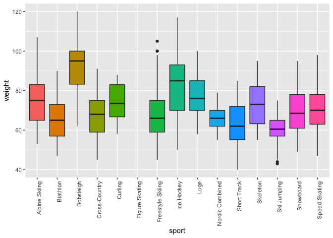
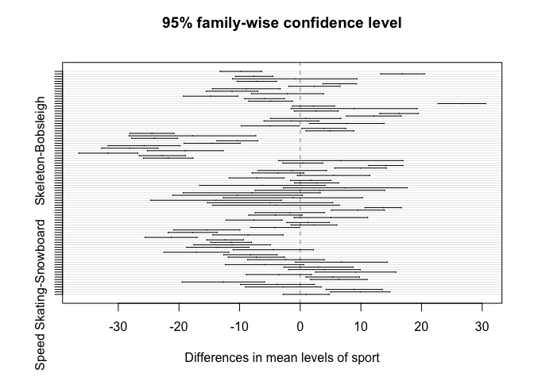

ANOVA example
================
Steven Moran
(06 March, 2023)

``` r
library(tidyverse)
library(knitr)
```

# Overview

``` r
athletes <- read_csv('../../datasets/athletes.csv')
```

``` r
head(athletes) %>% 
  kable()
```

| age | birthdate | name              | gender | height | weight | gold_medals | silver_medals | bronze_medals | total_medals | sport            | country       |
|----:|:----------|:------------------|:-------|-------:|-------:|------------:|--------------:|--------------:|-------------:|:-----------------|:--------------|
|  17 | 4/12/96   | Aaron Blunck      | Male   |   1.72 |     68 |           0 |             0 |             0 |            0 | Freestyle Skiing | United States |
|  27 | 5/14/86   | Aaron March       | Male   |   1.85 |     85 |           0 |             0 |             0 |            0 | Snowboard        | Italy         |
|  21 | 6/30/92   | Abzal Azhgaliyev  | Male   |   1.78 |     68 |           0 |             0 |             0 |            0 | Short Track      | Kazakhstan    |
|  21 | 5/25/92   | Abzal Rakimgaliev | Male   |   1.68 |     NA |           0 |             0 |             0 |            0 | Figure Skating   | Kazakhstan    |
|  21 | 7/30/92   | Adam Barwood      | Male   |   1.86 |     82 |           0 |             0 |             0 |            0 | Alpine Skiing    | New Zealand   |
|  21 | 12/18/92  | Adam Cieslar      | Male   |   1.75 |     57 |           0 |             0 |             0 |            0 | Nordic Combined  | Poland        |

# ANOVA

Analysis of variance
([ANOVA](https://en.wikipedia.org/wiki/Analysis_of_variance)) and
Multivariate analysis of variance
([MANOVA](https://en.wikipedia.org/wiki/Multivariate_analysis_of_variance))
tests are used when comparing the means of more than two groups (e.g.,
the average heights of children, teenagers, and adults).

ANOVA includes a family of statistical test that allow researchers to
investigate the differences between any number of groups as specified by
one or more categorical variables. ANOVA is used when you want to find
out if there are differences between several groups.

Assumptions of this test:

- Population distribution is normal
- Samples are random and independent
- Homogeneity of sample variance

How would you go forward, for example, with the `athletes` data?

Here is some example code to get you thinking.

``` r
m_sport_lm <- lm(weight ~ sport, data = athletes)
summary(m_sport_lm)
```

    ## 
    ## Call:
    ## lm(formula = weight ~ sport, data = athletes)
    ## 
    ## Residuals:
    ##     Min      1Q  Median      3Q     Max 
    ## -31.627  -8.528   0.668   8.132  37.042 
    ## 
    ## Coefficients:
    ##                       Estimate Std. Error t value Pr(>|t|)    
    ## (Intercept)            75.1221     0.6427 116.893  < 2e-16 ***
    ## sportBiathlon          -9.7905     1.0207  -9.592  < 2e-16 ***
    ## sportBobsleigh         16.8661     1.0720  15.734  < 2e-16 ***
    ## sportCross-Country     -7.5943     0.9206  -8.249 2.56e-16 ***
    ## sportCurling           -0.9078     3.0581  -0.297   0.7666    
    ## sportFreestyle Skiing  -7.1643     0.9701  -7.385 2.07e-13 ***
    ## sportIce Hockey         6.5053     0.8252   7.883 4.75e-15 ***
    ## sportLuge               2.3358     1.2580   1.857   0.0635 .  
    ## sportNordic Combined   -8.8957     1.6656  -5.341 1.01e-07 ***
    ## sportShort Track      -11.2542     1.2624  -8.915  < 2e-16 ***
    ## sportSkeleton          -2.1004     1.7702  -1.187   0.2355    
    ## sportSki Jumping      -14.7852     1.3316 -11.103  < 2e-16 ***
    ## sportSnowboard         -5.8786     0.9783  -6.009 2.14e-09 ***
    ## sportSpeed Skating     -4.8973     1.0740  -4.560 5.37e-06 ***
    ## ---
    ## Signif. codes:  0 '***' 0.001 '**' 0.01 '*' 0.05 '.' 0.1 ' ' 1
    ## 
    ## Residual standard error: 11.19 on 2467 degrees of freedom
    ##   (378 observations deleted due to missingness)
    ## Multiple R-squared:  0.3363, Adjusted R-squared:  0.3328 
    ## F-statistic: 96.17 on 13 and 2467 DF,  p-value: < 2.2e-16

``` r
anova(m_sport_lm)
```

    ## Analysis of Variance Table
    ## 
    ## Response: weight
    ##             Df Sum Sq Mean Sq F value    Pr(>F)    
    ## sport       13 156458 12035.2  96.173 < 2.2e-16 ***
    ## Residuals 2467 308725   125.1                      
    ## ---
    ## Signif. codes:  0 '***' 0.001 '**' 0.01 '*' 0.05 '.' 0.1 ' ' 1

``` r
names(m_sport_lm)
```

    ##  [1] "coefficients"  "residuals"     "effects"       "rank"         
    ##  [5] "fitted.values" "assign"        "qr"            "df.residual"  
    ##  [9] "na.action"     "contrasts"     "xlevels"       "call"         
    ## [13] "terms"         "model"

``` r
aov_athletes <- aov(weight ~ sport, data = athletes)
summary(aov_athletes)
```

    ##               Df Sum Sq Mean Sq F value Pr(>F)    
    ## sport         13 156458   12035   96.17 <2e-16 ***
    ## Residuals   2467 308725     125                   
    ## ---
    ## Signif. codes:  0 '***' 0.001 '**' 0.01 '*' 0.05 '.' 0.1 ' ' 1
    ## 378 observations deleted due to missingness

``` r
qplot(x = sport, y = weight, data = athletes, geom = "boxplot", fill = sport) + 
  theme(axis.text.x = element_text(angle = 90, hjust = 1)) + 
  theme(legend.position="none")
```

    ## Warning: `qplot()` was deprecated in ggplot2 3.4.0.

    ## Warning: Removed 378 rows containing non-finite values (`stat_boxplot()`).

<!-- -->

``` r
library(car)
```

    ## Loading required package: carData

    ## 
    ## Attaching package: 'car'

    ## The following object is masked from 'package:dplyr':
    ## 
    ##     recode

    ## The following object is masked from 'package:purrr':
    ## 
    ##     some

``` r
leveneTest(weight ~ sport, data = athletes)
```

    ## Warning in leveneTest.default(y = y, group = group, ...): group coerced to
    ## factor.

    ## Levene's Test for Homogeneity of Variance (center = median)
    ##         Df F value    Pr(>F)    
    ## group   13   11.64 < 2.2e-16 ***
    ##       2467                      
    ## ---
    ## Signif. codes:  0 '***' 0.001 '**' 0.01 '*' 0.05 '.' 0.1 ' ' 1

``` r
m_sport_aov <- aov(weight ~ sport, data = athletes)
summary(m_sport_aov)
```

    ##               Df Sum Sq Mean Sq F value Pr(>F)    
    ## sport         13 156458   12035   96.17 <2e-16 ***
    ## Residuals   2467 308725     125                   
    ## ---
    ## Signif. codes:  0 '***' 0.001 '**' 0.01 '*' 0.05 '.' 0.1 ' ' 1
    ## 378 observations deleted due to missingness

``` r
TukeyHSD(m_sport_aov)
```

    ##   Tukey multiple comparisons of means
    ##     95% family-wise confidence level
    ## 
    ## Fit: aov(formula = weight ~ sport, data = athletes)
    ## 
    ## $sport
    ##                                         diff         lwr         upr     p adj
    ## Biathlon-Alpine Skiing            -9.7904539 -13.2170047  -6.3639031 0.0000000
    ## Bobsleigh-Alpine Skiing           16.8661231  13.2674867  20.4647595 0.0000000
    ## Cross-Country-Alpine Skiing       -7.5943344 -10.6848387  -4.5038301 0.0000000
    ## Curling-Alpine Skiing             -0.9078265 -11.1737369   9.3580839 1.0000000
    ## Freestyle Skiing-Alpine Skiing    -7.1643063 -10.4208324  -3.9077802 0.0000000
    ## Ice Hockey-Alpine Skiing           6.5052968   3.7350480   9.2755456 0.0000000
    ## Luge-Alpine Skiing                 2.3358317  -1.8872734   6.5589369 0.8494386
    ## Nordic Combined-Alpine Skiing     -8.8956971 -14.4870760  -3.3043183 0.0000090
    ## Short Track-Alpine Skiing        -11.2541877 -15.4919889  -7.0163865 0.0000000
    ## Skeleton-Alpine Skiing            -2.1003731  -8.0428247   3.8420785 0.9961384
    ## Ski Jumping-Alpine Skiing        -14.7851557 -19.2554538 -10.3148575 0.0000000
    ## Snowboard-Alpine Skiing           -5.8786340  -9.1628487  -2.5944192 0.0000002
    ## Speed Skating-Alpine Skiing       -4.8972601  -8.5027104  -1.2918099 0.0004564
    ## Bobsleigh-Biathlon                26.6565770  22.7345069  30.5786471 0.0000000
    ## Cross-Country-Biathlon             2.1961195  -1.2656239   5.6578629 0.6806295
    ## Curling-Biathlon                   8.8826274  -1.5010794  19.2663342 0.1906029
    ## Freestyle Skiing-Biathlon          2.6261476  -0.9845881   6.2368833 0.4499714
    ## Ice Hockey-Biathlon               16.2957507  13.1166425  19.4748589 0.0000000
    ## Luge-Biathlon                     12.1262856   7.6243896  16.6281816 0.0000000
    ## Nordic Combined-Biathlon           0.8947568  -4.9100660   6.6995796 0.9999997
    ## Short Track-Biathlon              -1.4637338  -5.9794186   3.0519510 0.9983816
    ## Skeleton-Biathlon                  7.6900808   1.5463701  13.8337916 0.0022153
    ## Ski Jumping-Biathlon              -4.9947018  -9.7292573  -0.2601463 0.0274250
    ## Snowboard-Biathlon                 3.9118200   0.2760922   7.5475478 0.0215336
    ## Speed Skating-Biathlon             4.8931938   0.9648708   8.8215168 0.0024136
    ## Cross-Country-Bobsleigh          -24.4604575 -28.0926195 -20.8282956 0.0000000
    ## Curling-Bobsleigh                -17.7739496 -28.2157071  -7.3321921 0.0000011
    ## Freestyle Skiing-Bobsleigh       -24.0304294 -27.8048626 -20.2559962 0.0000000
    ## Ice Hockey-Bobsleigh             -10.3608263 -13.7247024  -6.9969502 0.0000000
    ## Luge-Bobsleigh                   -14.5302914 -19.1645120  -9.8960707 0.0000000
    ## Nordic Combined-Bobsleigh        -25.7618202 -31.6698572 -19.8537832 0.0000000
    ## Short Track-Bobsleigh            -28.1203108 -32.7679276 -23.4726939 0.0000000
    ## Skeleton-Bobsleigh               -18.9664962 -25.2078193 -12.7251730 0.0000000
    ## Ski Jumping-Bobsleigh            -31.6512788 -36.5118291 -26.7907285 0.0000000
    ## Snowboard-Bobsleigh              -22.7447570 -26.5431053 -18.9464087 0.0000000
    ## Speed Skating-Bobsleigh          -21.7633832 -25.8426791 -17.6840873 0.0000000
    ## Curling-Cross-Country              6.6865079  -3.5912026  16.9642184 0.6414022
    ## Freestyle Skiing-Cross-Country     0.4300281  -2.8635078   3.7235641 1.0000000
    ## Ice Hockey-Cross-Country          14.0996312  11.2859690  16.9132935 0.0000000
    ## Luge-Cross-Country                 9.9301661   5.6784566  14.1818757 0.0000000
    ## Nordic Combined-Cross-Country     -1.3013627  -6.9143774   4.3116520 0.9999591
    ## Short Track-Cross-Country         -3.6598532  -7.9261603   0.6064538 0.1869697
    ## Skeleton-Cross-Country             5.4939614  -0.4688524  11.4567751 0.1083531
    ## Ski Jumping-Cross-Country         -7.1908213 -11.6881518  -2.6934907 0.0000078
    ## Snowboard-Cross-Country            1.7157005  -1.6052155   5.0366165 0.9037181
    ## Speed Skating-Cross-Country        2.6970743  -0.9418387   6.3359873 0.4166303
    ## Freestyle Skiing-Curling          -6.2564798 -16.5853267   4.0723671 0.7464791
    ## Ice Hockey-Curling                 7.4131233  -2.7728668  17.5991134 0.4488518
    ## Luge-Curling                       3.2436582  -7.4294263  13.9167427 0.9991737
    ## Nordic Combined-Curling           -7.9878706 -19.2725343   3.2967930 0.4980067
    ## Short Track-Curling              -10.3463612 -21.0252691   0.3325468 0.0687714
    ## Skeleton-Curling                  -1.1925466 -12.6552185  10.2701253 1.0000000
    ## Ski Jumping-Curling              -13.8773292 -24.6506148  -3.1040436 0.0013123
    ## Snowboard-Curling                 -4.9708075 -15.3084176   5.3668026 0.9426934
    ## Speed Skating-Curling             -3.9894336 -14.4335414   6.4546741 0.9918811
    ## Ice Hockey-Freestyle Skiing       13.6696031  10.6745337  16.6646725 0.0000000
    ## Luge-Freestyle Skiing              9.5001380   5.1262634  13.8740126 0.0000000
    ## Nordic Combined-Freestyle Skiing  -1.7313908  -7.4374998   3.9747182 0.9991875
    ## Short Track-Freestyle Skiing      -4.0898814  -8.4779471   0.2981844 0.0981592
    ## Skeleton-Freestyle Skiing          5.0639332  -0.9865951  11.1144616 0.2201169
    ## Ski Jumping-Freestyle Skiing      -7.6208494 -12.2338449  -3.0078539 0.0000029
    ## Snowboard-Freestyle Skiing         1.2856724  -2.1902776   4.7616223 0.9940079
    ## Speed Skating-Freestyle Skiing     2.2670462  -1.5138841   6.0479764 0.7597873
    ## Luge-Ice Hockey                   -4.1694651  -8.1943993  -0.1445308 0.0339511
    ## Nordic Combined-Ice Hockey       -15.4009939 -20.8442462  -9.9577416 0.0000000
    ## Short Track-Ice Hockey           -17.7594845 -21.7998356 -13.7191333 0.0000000
    ## Skeleton-Ice Hockey               -8.6056699 -14.4089628  -2.8023769 0.0000604
    ## Ski Jumping-Ice Hockey           -21.2904525 -25.5740309 -17.0068741 0.0000000
    ## Snowboard-Ice Hockey             -12.3839307 -15.4090827  -9.3587787 0.0000000
    ## Speed Skating-Ice Hockey         -11.4025569 -14.7737214  -8.0313925 0.0000000
    ## Nordic Combined-Luge             -11.2315288 -17.5394076  -4.9236501 0.0000002
    ## Short Track-Luge                 -13.5900194 -18.7363556  -8.4436832 0.0000000
    ## Skeleton-Luge                     -4.4362048 -11.0572733   2.1848637 0.5931044
    ## Ski Jumping-Luge                 -17.1209874 -22.4604052 -11.7815696 0.0000000
    ## Snowboard-Luge                    -8.2144657 -12.6089945  -3.8199369 0.0000000
    ## Speed Skating-Luge                -7.2330919 -11.8726057  -2.5935781 0.0000160
    ## Short Track-Nordic Combined       -2.3584906  -8.6762177   3.9592366 0.9934572
    ## Skeleton-Nordic Combined           6.7953240  -0.7722019  14.3628500 0.1336207
    ## Ski Jumping-Nordic Combined       -5.8894586 -12.3654360   0.5865188 0.1207242
    ## Snowboard-Nordic Combined          3.0170632  -2.7048931   8.7390195 0.8894167
    ## Speed Skating-Nordic Combined      3.9984370  -1.9137529   9.9106268 0.5773026
    ## Skeleton-Short Track               9.1538146   2.5233629  15.7842663 0.0003222
    ## Ski Jumping-Short Track           -3.5309680  -8.8820169   1.8200809 0.6184548
    ## Snowboard-Short Track              5.3755537   0.9669003   9.7842072 0.0034777
    ## Speed Skating-Short Track          6.3569275   1.7040328  11.0098223 0.0004034
    ## Ski Jumping-Skeleton             -12.6847826 -19.4661908  -5.9033745 0.0000000
    ## Snowboard-Skeleton                -3.7782609  -9.8437367   2.2872150 0.7076525
    ## Speed Skating-Skeleton            -2.7968871  -9.0421414   3.4483673 0.9672417
    ## Snowboard-Ski Jumping              8.9065217   4.2739380  13.5391054 0.0000000
    ## Speed Skating-Ski Jumping          9.8878955   5.0222983  14.7534928 0.0000000
    ## Speed Skating-Snowboard            0.9813738  -2.8234307   4.7861783 0.9998622

``` r
plot(TukeyHSD(m_sport_aov))
```

<!-- -->

``` r
m_sport_aovlm <- anova(lm(weight ~ sport, data = athletes))
m_sport_aovlm
```

    ## Analysis of Variance Table
    ## 
    ## Response: weight
    ##             Df Sum Sq Mean Sq F value    Pr(>F)    
    ## sport       13 156458 12035.2  96.173 < 2.2e-16 ***
    ## Residuals 2467 308725   125.1                      
    ## ---
    ## Signif. codes:  0 '***' 0.001 '**' 0.01 '*' 0.05 '.' 0.1 ' ' 1

``` r
oneway.test(weight ~ sport, data = athletes)
```

    ## 
    ##  One-way analysis of means (not assuming equal variances)
    ## 
    ## data:  weight and sport
    ## F = 102.66, num df = 13.00, denom df = 384.94, p-value < 2.2e-16
