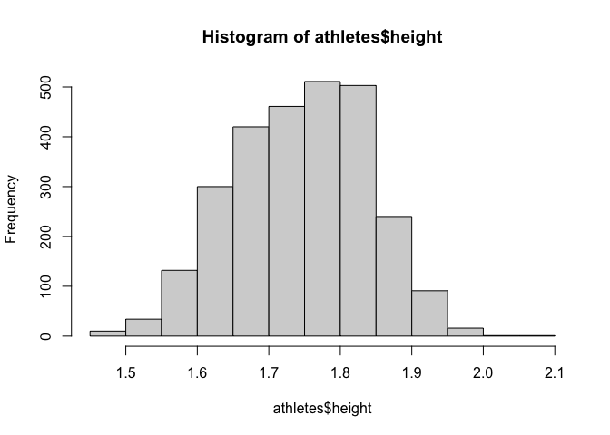

Linear regression example: athletes height vs. weight
================
Steve Moran
(09 March, 2023)

- [Overvierw](#overvierw)
- [Load the data](#load-the-data)
- [Define your hypothesis](#define-your-hypothesis)
- [Choose a statistical test](#choose-a-statistical-test)
- [Check your model assumptions](#check-your-model-assumptions)
- [Perform the linear regression
  analysis](#perform-the-linear-regression-analysis)
- [Check for homoscedasticity](#check-for-homoscedasticity)

------------------------------------------------------------------------

``` r
library(tidyverse)
library(knitr)
```

------------------------------------------------------------------------

# Overvierw

Statistical modeling is an attempt to describe some part of the real
world in mathematical terms.

The relevant mathematical concept is the one of **function**.

Consider for example the input of `height` and output of `weight` with
our `atheletes` data.

# Load the data

Let’s load the data.

``` r
athletes <- read_csv('../../datasets/athletes.csv')
```

And have a look at it.

``` r
head(athletes) %>% 
  kable()
```

| age | birthdate | name              | gender | height | weight | gold_medals | silver_medals | bronze_medals | total_medals | sport            | country       |
|----:|:----------|:------------------|:-------|-------:|-------:|------------:|--------------:|--------------:|-------------:|:-----------------|:--------------|
|  17 | 4/12/96   | Aaron Blunck      | Male   |   1.72 |     68 |           0 |             0 |             0 |            0 | Freestyle Skiing | United States |
|  27 | 5/14/86   | Aaron March       | Male   |   1.85 |     85 |           0 |             0 |             0 |            0 | Snowboard        | Italy         |
|  21 | 6/30/92   | Abzal Azhgaliyev  | Male   |   1.78 |     68 |           0 |             0 |             0 |            0 | Short Track      | Kazakhstan    |
|  21 | 5/25/92   | Abzal Rakimgaliev | Male   |   1.68 |     NA |           0 |             0 |             0 |            0 | Figure Skating   | Kazakhstan    |
|  21 | 7/30/92   | Adam Barwood      | Male   |   1.86 |     82 |           0 |             0 |             0 |            0 | Alpine Skiing    | New Zealand   |
|  21 | 12/18/92  | Adam Cieslar      | Male   |   1.75 |     57 |           0 |             0 |             0 |            0 | Nordic Combined  | Poland        |

# Define your hypothesis

Recall any hypothesis testing follows these steps, broadly speaking:

1.  Choose a significance level (α)
2.  Formulate a null hypothesis, H0
3.  Formulate an alternative hypothesis, H1
4.  Gather data, calculate a test statistic, e.g. T or F
5.  Determine the probability (p-value) of obtaining T or F “or a more
    extreme value” under H0
6.  If p ≤ α, reject H0

And the basic process is:

- Set up a hypothesis, and assume that it is true.
- Gather data from some real-world experiment that is relevant to the
  hypothesis.
- Make a determination about the hypothesis, based on the idea of “how
  likely is our data given the hypothesis?”

Let’s go through an example.

------------------------------------------------------------------------

First, let’s set up our hypothesis regarding height vs weight of the
athletes.

- H0:
- H1:

We have data already, let’s look at what data types that we have. And
here’s its structure:

``` r
str(athletes)
```

    ## spc_tbl_ [2,859 × 12] (S3: spec_tbl_df/tbl_df/tbl/data.frame)
    ##  $ age          : num [1:2859] 17 27 21 21 21 21 18 23 17 21 ...
    ##  $ birthdate    : chr [1:2859] "4/12/96" "5/14/86" "6/30/92" "5/25/92" ...
    ##  $ name         : chr [1:2859] "Aaron Blunck" "Aaron March" "Abzal Azhgaliyev" "Abzal Rakimgaliev" ...
    ##  $ gender       : chr [1:2859] "Male" "Male" "Male" "Male" ...
    ##  $ height       : num [1:2859] 1.72 1.85 1.78 1.68 1.86 1.75 1.7 1.78 1.63 1.62 ...
    ##  $ weight       : num [1:2859] 68 85 68 NA 82 57 76 80 NA 56 ...
    ##  $ gold_medals  : num [1:2859] 0 0 0 0 0 0 0 0 0 0 ...
    ##  $ silver_medals: num [1:2859] 0 0 0 0 0 0 0 0 0 0 ...
    ##  $ bronze_medals: num [1:2859] 0 0 0 0 0 0 0 0 0 0 ...
    ##  $ total_medals : num [1:2859] 0 0 0 0 0 0 0 0 0 0 ...
    ##  $ sport        : chr [1:2859] "Freestyle Skiing" "Snowboard" "Short Track" "Figure Skating" ...
    ##  $ country      : chr [1:2859] "United States" "Italy" "Kazakhstan" "Kazakhstan" ...
    ##  - attr(*, "spec")=
    ##   .. cols(
    ##   ..   age = col_double(),
    ##   ..   birthdate = col_character(),
    ##   ..   name = col_character(),
    ##   ..   gender = col_character(),
    ##   ..   height = col_double(),
    ##   ..   weight = col_double(),
    ##   ..   gold_medals = col_double(),
    ##   ..   silver_medals = col_double(),
    ##   ..   bronze_medals = col_double(),
    ##   ..   total_medals = col_double(),
    ##   ..   sport = col_character(),
    ##   ..   country = col_character()
    ##   .. )
    ##  - attr(*, "problems")=<externalptr>

Recall our discussion on [data types in
statistics](https://github.com/bambooforest/IntroDataScience/tree/main/3_data#data-types-in-statistics).

# Choose a statistical test

What kind of statistical test can we use to test if there’s a
relationship between these two variables?

Recall that the independent variable (predictor variable) is the
variable that is being manipulated, so that we can observe if there is
an effect on the dependent variable (outcome variable).

- Independent variable(s) – Predictor variable(s)
- Dependent variable(s) – Outcome/Output variable(s)

One way to look at that relationship is to **plot the input** on the
x-axis and the output on the y-axis in a scatter plot.

``` r
ggplot(athletes, aes(height, weight)) +
  geom_point()
```

    ## Warning: Removed 380 rows containing missing values (`geom_point()`).

<!-- -->

One way to test whether there is a relationship with two continuous data
points is to use [linear
regression](https://en.wikipedia.org/wiki/Linear_regression).

``` r
ggplot(athletes, aes(height, weight)) +
  geom_point() +
  geom_smooth(method='lm')
```

    ## `geom_smooth()` using formula = 'y ~ x'

    ## Warning: Removed 380 rows containing non-finite values (`stat_smooth()`).

    ## Warning: Removed 380 rows containing missing values (`geom_point()`).

<!-- -->

# Check your model assumptions

But hold on. Just because we see a pattern does not necessarily mean
it’s there. We have to be careful of statistical bias. How can we
control for bias?

Like other statistical tests, **you will have to know the (four) main
assumptions** for linear regression, i.e.:

- [Independence](https://en.wikipedia.org/wiki/Independence_(probability_theory))
  of observations (aka no
  [autocorrelation](https://en.wikipedia.org/wiki/Autocorrelation))
- [Normality](https://en.wikipedia.org/wiki/Normal_distribution)
- [Linearity](https://en.wikipedia.org/wiki/Linear_regression)
- [Homoscedasticity](https://en.wikipedia.org/wiki/Homoscedasticity_and_heteroscedasticity)
  (aka homogeneity of variance)

Two events are **independent** if the occurrence of one event does not
affect the chances of the occurrence of the other event.

We test for **normality** to see whether a set of data is distributed in
a way that is consistent with a [normal
distribution](https://en.wikipedia.org/wiki/Normal_distribution), when
our statistical test requires that the data points are normally
distributed.

**Linearity** is demonstrated when the mean values of the outcome
variable (dependent variable) for each increment of the predictors
(independent variables) lies along a straight line.

**Homoscedasticity** (homogeneity of variances) is an assumption of
equal or similar variances in different groups being compared.

<!--
[Parametric statistical test](https://en.wikipedia.org/wiki/Parametric_statistics) assume that data points in the sample come from a population that can be modeled by a [probability distribution](https://en.wikipedia.org/wiki/Probability_distribution) (i.e., a mathematical function that describes the probabilities of occurrence of the outcomes in an experiment) and that has a fixed set of [statistical parameters](https://en.wikipedia.org/wiki/Statistical_parameter). This assumption is important because parametric statistical tests are sensitive to any dissimilarities and uneven variance in samples will bias and skew the results.
-->

Here is a good and simple overview of linear models:

- <https://www.scribbr.com/statistics/linear-regression-in-r/>

------------------------------------------------------------------------

1.  Independence

For height and weight, we only have one independent variable and one
dependent variable for each athlete, so we don’t need to test for any
hidden relationships among the variables. In other words, we have
independence of observations.

2.  Normality

We need to check if the dependent variable is normally distributed. We
can quickly visualize it. Does it look normal?

``` r
hist(athletes$height)
```

<!-- -->

Another way to look for normality is with a quantile-quantile plot (Q-Q
plot), which is a graphical tool to assess whether the data come from
some probability distribution. It is a scatter plot that plots two sets
of [quantiles](https://en.wikipedia.org/wiki/Quantile) against each
other. If for example, we have a relatively straight line, we may assume
that our data points come from a normal distribution.

``` r
qqnorm(athletes$height, pch = 1, frame = FALSE) # Create the Q-Qplot
qqline(athletes$height, col = "steelblue", lwd = 2) # Add a blue line for reference
```

<!-- -->

3.  Linearity

As we saw above, the data are linearly distributed. Here’s another way
to quickly visualize the x and y variables.

``` r
plot(weight ~ height, data = athletes)
```

<!-- -->

4.  Homoscedasticity (aka homogeneity of variance)

This means that the prediction error doesn’t change significantly over
the range of prediction of the model. We can test this assumption later,
after fitting the linear model.

# Perform the linear regression analysis

So now we can do our linear regression and interpret the results.

``` r
lm <- lm(weight ~ height, data = athletes)
summary(lm)
```

    ## 
    ## Call:
    ## lm(formula = weight ~ height, data = athletes)
    ## 
    ## Residuals:
    ##      Min       1Q   Median       3Q      Max 
    ## -28.4176  -5.3995  -0.3995   5.0461  27.8007 
    ## 
    ## Coefficients:
    ##             Estimate Std. Error t value Pr(>|t|)    
    ## (Intercept) -147.362      2.974  -49.55   <2e-16 ***
    ## height       125.454      1.690   74.23   <2e-16 ***
    ## ---
    ## Signif. codes:  0 '***' 0.001 '**' 0.01 '*' 0.05 '.' 0.1 ' ' 1
    ## 
    ## Residual standard error: 7.613 on 2477 degrees of freedom
    ##   (380 observations deleted due to missingness)
    ## Multiple R-squared:  0.6899, Adjusted R-squared:  0.6898 
    ## F-statistic:  5510 on 1 and 2477 DF,  p-value: < 2.2e-16

------------------------------------------------------------------------

Can we say there is a significant positive relationship between height
and weight of these athletes (p-value \< 0.001).

------------------------------------------------------------------------

# Check for homoscedasticity

``` r
par(mfrow=c(2,2))
plot(lm)
```

<!-- -->

``` r
par(mfrow=c(1,1))
```

Residuals are the unexplained variance. They are not exactly the same as
model error, but they are calculated from it, so seeing a bias in the
residuals would also indicate a bias in the error.

The most important thing to look for is that the red lines representing
the mean of the residuals are all basically horizontal and centered
around zero. This means there are no outliers or biases in the data that
would make a linear regression invalid.

In the Normal Q-Qplot in the top right, we can see that the real
residuals from our model form an almost perfectly one-to-one line with
the theoretical residuals from a perfect model.

Based on these residuals, we can say that our model meets the assumption
of homoscedasticity.

------------------------------------------------------------------------

Statistical tests are about interpreting data. If we want to interpret
our data with formal procedures and to make claims about the
distribution of our data or whether two data sets differ fundamentally
from each other, then we rely on hypothesis testing.
