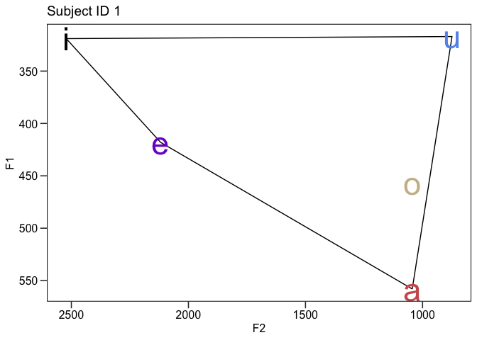
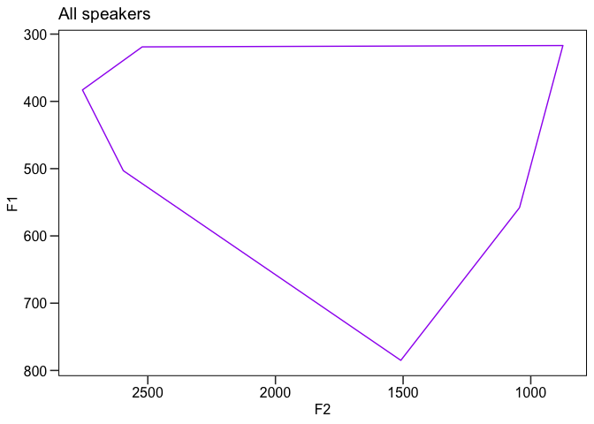
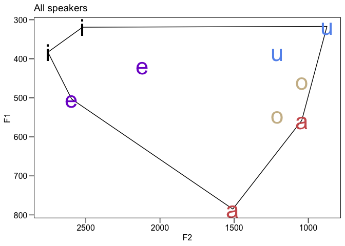
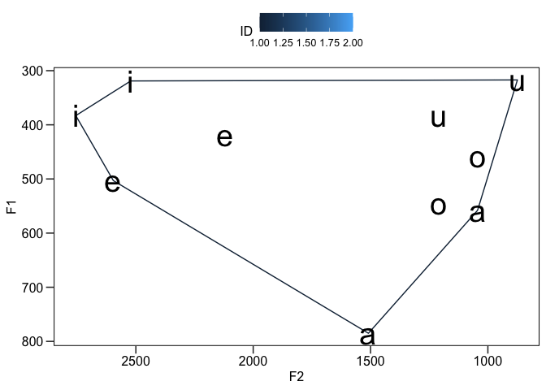
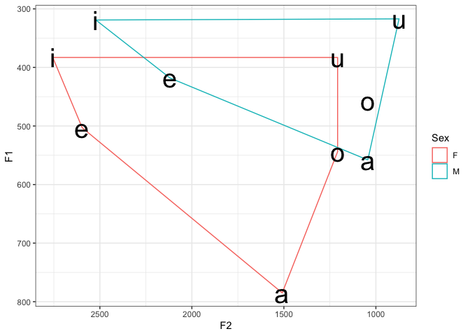
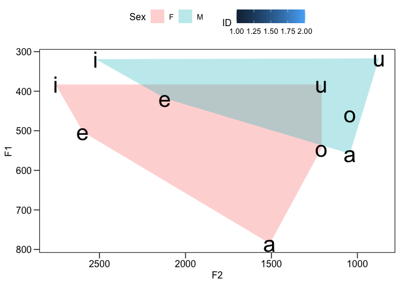
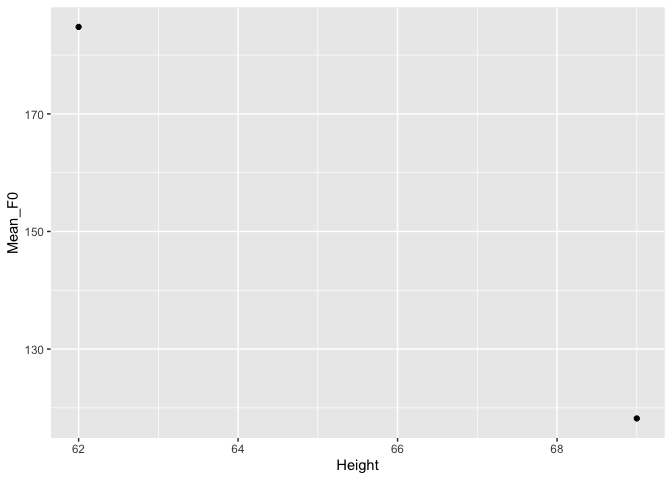
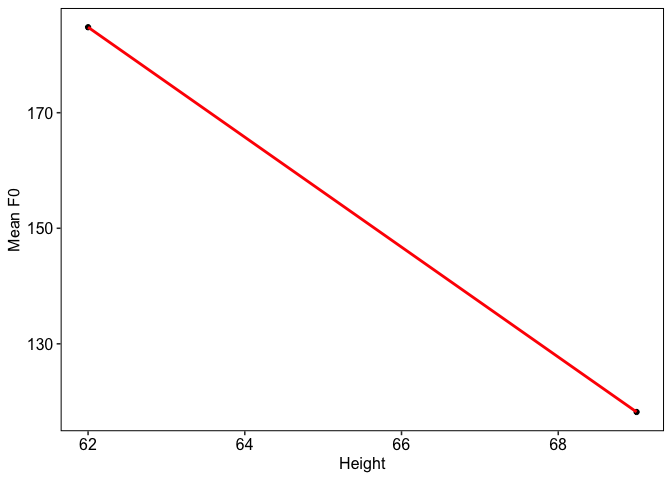

Vowel formants example
================
Steven Moran
(17 October, 2023)

- [Getting started](#getting-started)
  - [Load the R packages that we need for
    analysis](#load-the-r-packages-that-we-need-for-analysis)
  - [Load some example vowel data](#load-some-example-vowel-data)
  - [Have a look at the raw data](#have-a-look-at-the-raw-data)
- [Working with the data](#working-with-the-data)
  - [Overview](#overview)
  - [Single speaker](#single-speaker)
  - [All speakers](#all-speakers)
- [Analyses](#analyses)
  - [Phonetic differences by sex](#phonetic-differences-by-sex)
  - [Differences in pitch](#differences-in-pitch)
  - [Pitch versus height](#pitch-versus-height)
- [Notes](#notes)

# Getting started

## Load the R packages that we need for analysis

In R, you need to install (once) any R software package (aka library)
that you want to use, before you load it with the `library()` function.

This code will check whether or not you have those packages, and if not,
will install them and load the packages for you.

``` r
if(!require("tidyverse")) install.packages("tidyverse")
if(!require("ggpubr")) install.packages("ggpubr")
if(!require("devtools")) install.packages("devtools")
library(devtools)
if(!require("ggConvexHull")) devtools::install_github("cmartin/ggConvexHull")
```

Once a package is already installed on your computer, you can simply
load it with the `library()` function, like this:

``` r
library(tidyverse)
library(ggpubr)
library(ggConvexHull)
```

If you want to know what these do, see the notes section at the end of
this file.

## Load some example vowel data

First make sure that you set your working directory to where this file
is by clicking on RStudio \> Session \> Set Working Directory \> To
Source File Location.

Then we can load some example data in the same directory as this file.

``` r
df <- read_csv('data.csv')
```

Note that this is an example, and what you really want to be able to do
is load the data that we collect in class from in the Google
spreadsheet.

To do so, first download it from the shared Google sheets as a [CSV
file](https://en.wikipedia.org/wiki/Comma-separated_values).

Put it in the same directory as this file.

Then you can load it with the same command above.

## Have a look at the raw data

Let’s have a look at the data.

``` r
df
```

    ## # A tibble: 10 × 10
    ##       ID Word  Vowel    F0    F1    F2    F3 Sex   L1      Height
    ##    <dbl> <chr> <chr> <dbl> <dbl> <dbl> <dbl> <chr> <chr>    <dbl>
    ##  1     1 heed  i       120   319  2522  3299 M     English     69
    ##  2     1 hayed e       115   418  2119  3631 M     English     69
    ##  3     1 hawed a       115   558  1044  2677 M     English     69
    ##  4     1 who'd u       122   317   874  2668 M     English     69
    ##  5     1 hoed  o       119   457  1044  2587 M     English     69
    ##  6     2 heed  i       180   383  2756  3159 F     English     62
    ##  7     2 hayed e       181   503  2596  2937 F     English     62
    ##  8     2 hawed a       177   785  1509  2817 F     English     62
    ##  9     2 who'd u       201   383  1208  2837 F     English     62
    ## 10     2 hoed  o       185   544  1208  2817 F     English     62

# Working with the data

## Overview

We had a quick look at the raw data. You can also do directly in RStudio
by clicking on the dataframe in the Environment tab.

There are lots of ways of doing preliminary data analysis and one great
way is to visualize the data!

Recall our discussion of how the International Phonetic Alphabet (IPA)
[vowel chart](https://en.wikipedia.org/wiki/Vowel_diagram) looks – head
faces left, vertical access is the jaw’s height (closed to open) and the
horizontal access is the position of the tongue (front to back in the
mouth).

## Single speaker

Let’s look at one speaker in our sample. This is where the data
manipulation R package [dplyr](https://dplyr.tidyverse.org) comes in
handy!

The dplyr package has several functions that allow us to `filter()` rows
and to `select()` columns (among many other useful things!).

Let’s filter out a single speaker and plot their vowels. You can set the
ID to yourself!

``` r
single_speaker <- df %>% filter(ID == 1)
```

Above, we have saved the output of filtering by `ID == 1` (read “subject
ID equals one”) to a new data frame and named it `single_speaker`. Let’s
have a look.

``` r
single_speaker
```

    ## # A tibble: 5 × 10
    ##      ID Word  Vowel    F0    F1    F2    F3 Sex   L1      Height
    ##   <dbl> <chr> <chr> <dbl> <dbl> <dbl> <dbl> <chr> <chr>    <dbl>
    ## 1     1 heed  i       120   319  2522  3299 M     English     69
    ## 2     1 hayed e       115   418  2119  3631 M     English     69
    ## 3     1 hawed a       115   558  1044  2677 M     English     69
    ## 4     1 who'd u       122   317   874  2668 M     English     69
    ## 5     1 hoed  o       119   457  1044  2587 M     English     69

Now let’s plot Subject ID 1’s vowel formant values for F1 and F2.

``` r
ggplot(single_speaker, aes(x = F2, y = F1, color = Vowel)) + 
  geom_convexhull(alpha = 0, colour = "black") +
  geom_text(aes(label = Vowel), size = 12) +
  scale_x_reverse() +
  scale_y_reverse() +
  coord_cartesian() +
  theme_pubr(border = TRUE, legend = "none") +
  theme(axis.ticks.length = unit(.25, "cm")) +
  scale_color_manual(
    name = "Vowel",
    values = c(
      "a" = "indianred",
      "i" = "black",
      "u" = "cornflowerblue",
      "o" = "wheat3",
      "e" = "purple3"
    )
  ) +
  ggtitle('Subject ID 1')
```

<!-- -->

We can also get a summary of the data.

``` r
summary(df)
```

    ##        ID          Word              Vowel                 F0       
    ##  Min.   :1.0   Length:10          Length:10          Min.   :115.0  
    ##  1st Qu.:1.0   Class :character   Class :character   1st Qu.:119.2  
    ##  Median :1.5   Mode  :character   Mode  :character   Median :149.5  
    ##  Mean   :1.5                                         Mean   :151.5  
    ##  3rd Qu.:2.0                                         3rd Qu.:180.8  
    ##  Max.   :2.0                                         Max.   :201.0  
    ##        F1              F2             F3           Sex           
    ##  Min.   :317.0   Min.   : 874   Min.   :2587   Length:10         
    ##  1st Qu.:383.0   1st Qu.:1085   1st Qu.:2712   Class :character  
    ##  Median :437.5   Median :1358   Median :2827   Mode  :character  
    ##  Mean   :466.7   Mean   :1688   Mean   :2943                     
    ##  3rd Qu.:533.8   3rd Qu.:2421   3rd Qu.:3104                     
    ##  Max.   :785.0   Max.   :2756   Max.   :3631                     
    ##       L1                Height    
    ##  Length:10          Min.   :62.0  
    ##  Class :character   1st Qu.:62.0  
    ##  Mode  :character   Median :65.5  
    ##                     Mean   :65.5  
    ##                     3rd Qu.:69.0  
    ##                     Max.   :69.0

## All speakers

Let’s plot all of the F1 and F2 formants in our sample and see what they
look like. We use the `ggplot()` function with lots of other functions.
This is complicated – do not worry, we will go through this mess in
class.

``` r
ggplot(df, aes(x = F2, y = F1, color = Vowel)) +
  geom_convexhull(alpha = 0, colour = "purple") +
  scale_x_reverse() +
  scale_y_reverse() +
    coord_cartesian() +
  theme_pubr(border = TRUE, legend = "none") +
  theme(axis.ticks.length = unit(.25, "cm")) +
  scale_color_manual(
    name = "Vowel",
    values = c(
      "a" = "indianred",
      "i" = "black",
      "u" = "cornflowerblue",
      "o" = "wheat3",
      "e" = "purple3"
    )
  ) +
  ggtitle('All speakers')
```

<!-- -->

``` r
ggplot(df, aes(x = F2, y = F1, color = Vowel)) + 
  geom_convexhull(alpha = 0, colour = "black") +
  geom_text(aes(label = Vowel), size = 12) +
  scale_x_reverse() +
  scale_y_reverse() +
  coord_cartesian() +
  theme_pubr(border = TRUE, legend = "none") +
  theme(axis.ticks.length = unit(.25, "cm")) +
  scale_color_manual(
    name = "Vowel",
    values = c(
      "a" = "indianred",
      "i" = "black",
      "u" = "cornflowerblue",
      "o" = "wheat3",
      "e" = "purple3"
    )
  ) +
  ggtitle('All speakers')
```

<!-- -->

For each speaker, we can add the vowel polygon lines.

``` r
ggplot(df, aes(x = F2, y = F1)) +
  geom_convexhull(alpha = 0, aes(colour = ID)) +
  geom_text(aes(label = Vowel), size = 10) +
  scale_x_reverse() +
  scale_y_reverse() +
  coord_cartesian() +
  theme_pubr(border = TRUE) +
  theme(axis.ticks.length = unit(.25, "cm"))
```

<!-- -->

# Analyses

## Phonetic differences by sex

Let’s plot individual vowel polygons by the reported sex of the speaker.
As we expect from the literature on [phonetic differences between male
and female
speech](https://compass.onlinelibrary.wiley.com/doi/abs/10.1111/j.1749-818X.2009.00125.x),
the vowel polygon of the women in our sample displays greater acoustic
range than the men.

``` r
ggplot(df, aes(x = F2, y = F1)) +
  geom_convexhull(alpha = 0, aes(colour = Sex)) +
  geom_text(aes(label = Vowel), size = 10) +
  scale_x_reverse() +
  scale_y_reverse() +
  coord_cartesian() +
  theme_pubr(border = TRUE) +
  theme(axis.ticks.length = unit(.25, "cm")) +
  theme_bw()
```

<!-- -->

We can also plot individual vowel polygon spaces by sex and filled in by
color.

``` r
ggplot(df, aes(x = F2, y = F1)) +
  geom_convexhull(alpha = 0.3, lwd = 0, aes(colour = ID, fill = Sex)) +
  geom_text(aes(label = Vowel), size = 10) +
  scale_x_reverse() +
  scale_y_reverse() +
  coord_cartesian() +
  theme_pubr(border = TRUE) +
  theme(axis.ticks.length = unit(.25, "cm"))
```

<!-- -->

## Differences in pitch

Recall that we also recorded our F0 – our fundamental frequency, which
we perceive as our pitch. This is in the F0 column of our data frame:

``` r
head(df)
```

    ## # A tibble: 6 × 10
    ##      ID Word  Vowel    F0    F1    F2    F3 Sex   L1      Height
    ##   <dbl> <chr> <chr> <dbl> <dbl> <dbl> <dbl> <chr> <chr>    <dbl>
    ## 1     1 heed  i       120   319  2522  3299 M     English     69
    ## 2     1 hayed e       115   418  2119  3631 M     English     69
    ## 3     1 hawed a       115   558  1044  2677 M     English     69
    ## 4     1 who'd u       122   317   874  2668 M     English     69
    ## 5     1 hoed  o       119   457  1044  2587 M     English     69
    ## 6     2 heed  i       180   383  2756  3159 F     English     62

Again, we access any column in the data frame with the `$` operator with
the name of the column as the suffix, e.g. let’s get all values (aka
observations, rows) of F0:

``` r
df$F0
```

    ##  [1] 120 115 115 122 119 180 181 177 201 185

We can also use various R functions on columns. For example, you can
summarize numerical values from a column with the `summary()` function!

``` r
summary(df$F0)
```

    ##    Min. 1st Qu.  Median    Mean 3rd Qu.    Max. 
    ##   115.0   119.2   149.5   151.5   180.8   201.0

Perhaps we want to summarize the F0 by sex? In “[base
R](https://iqss.github.io/dss-workshops/R/Rintro/base-r-cheat-sheet.pdf)”:

``` r
# Get a column by name
df$F0
```

    ##  [1] 120 115 115 122 119 180 181 177 201 185

``` r
# Get rows by filtering the contents of a colum; here by "sex is F(emale)"
df[df$Sex == "F", ]
```

    ## # A tibble: 5 × 10
    ##      ID Word  Vowel    F0    F1    F2    F3 Sex   L1      Height
    ##   <dbl> <chr> <chr> <dbl> <dbl> <dbl> <dbl> <chr> <chr>    <dbl>
    ## 1     2 heed  i       180   383  2756  3159 F     English     62
    ## 2     2 hayed e       181   503  2596  2937 F     English     62
    ## 3     2 hawed a       177   785  1509  2817 F     English     62
    ## 4     2 who'd u       201   383  1208  2837 F     English     62
    ## 5     2 hoed  o       185   544  1208  2817 F     English     62

``` r
# Get just the contents of the column we want by the filter -- ugh this is painful!
df[df$Sex == "F", ]$F0
```

    ## [1] 180 181 177 201 185

``` r
# Now let's summarize that mess
summary(df[df$Sex == "F", ]$F0)
```

    ##    Min. 1st Qu.  Median    Mean 3rd Qu.    Max. 
    ##   177.0   180.0   181.0   184.8   185.0   201.0

``` r
# And the men
summary(df[df$Sex == "M", ]$F0)
```

    ##    Min. 1st Qu.  Median    Mean 3rd Qu.    Max. 
    ##   115.0   115.0   119.0   118.2   120.0   122.0

## Pitch versus height

Lastly, let’s see if there is a correlation between one’s height and
one’s F0.

First, let’s get the data we want by “grouping” the height variable and
summarizing the mean F0 for each by height.

``` r
tmp <- df %>% group_by(Height) %>% summarize(Mean_F0 = mean(F0))
```

Now let’s plot the results as a linear regression.

``` r
ggplot(tmp, aes(x=Height, y=Mean_F0)) +
  geom_point()
```

<!-- -->

``` r
ggplot(tmp, aes(Height, Mean_F0)) +
  geom_point(colour = "black", alpha = 1) +
  xlab("Height") +
  ylab("Mean F0") +
  theme_pubr(border = TRUE, margin = TRUE) + 
  geom_smooth(method = "lm", se = FALSE, colour = "red") +
  ggpubr::stat_cor(aes(label = paste(..rr.label.., ..p.label.., sep = "~`,`~")))
```

    ## Warning: The dot-dot notation (`..rr.label..`) was deprecated in ggplot2 3.4.0.
    ## ℹ Please use `after_stat(rr.label)` instead.
    ## This warning is displayed once every 8 hours.
    ## Call `lifecycle::last_lifecycle_warnings()` to see where this warning was
    ## generated.

    ## `geom_smooth()` using formula = 'y ~ x'

    ## Warning: Computation failed in `stat_cor()`
    ## Caused by error in `cor.test.default()`:
    ## ! not enough finite observations

<!-- -->

We can also get the model statistics directly from the data with these
functions.

``` r
model1 <- lm(Mean_F0 ~ Height, data = tmp)
summary(model1)
```

    ## 
    ## Call:
    ## lm(formula = Mean_F0 ~ Height, data = tmp)
    ## 
    ## Residuals:
    ## ALL 2 residuals are 0: no residual degrees of freedom!
    ## 
    ## Coefficients:
    ##             Estimate Std. Error t value Pr(>|t|)
    ## (Intercept)  774.686         NA      NA       NA
    ## Height        -9.514         NA      NA       NA
    ## 
    ## Residual standard error: NaN on 0 degrees of freedom
    ## Multiple R-squared:      1,  Adjusted R-squared:    NaN 
    ## F-statistic:   NaN on 1 and 0 DF,  p-value: NA

# Notes

Some notes on what these libraries do (you can skip this and go to the
next section):

The [tidyverse](https://www.tidyverse.org) package will install several
[R packages](https://www.tidyverse.org/packages/) including:

- [ggplot](https://ggplot2.tidyverse.org) for creating nice looking
  plots
- [dplyr](https://dplyr.tidyverse.org) for manipulating data easily

We are going to additionally use
[ggpubr](http://www.sthda.com/english/wiki/ggpubr-create-easily-publication-ready-plots)
package because it is helpful in making [professional looking
plots](https://medium.com/swlh/beautiful-charts-with-r-and-ggpubr-c94122d6b7c6).

And the [ggConvexHull](https://github.com/cmartin/ggConvexHull) package,
which extends the `geom_polyon()` function in the ggplot package, so
that we can add a [convex
hull](https://en.wikipedia.org/wiki/Convex_hull) around our vowel
polygon data. This package is available via GitHub and hence the
[devtools](https://devtools.r-lib.org) package.
