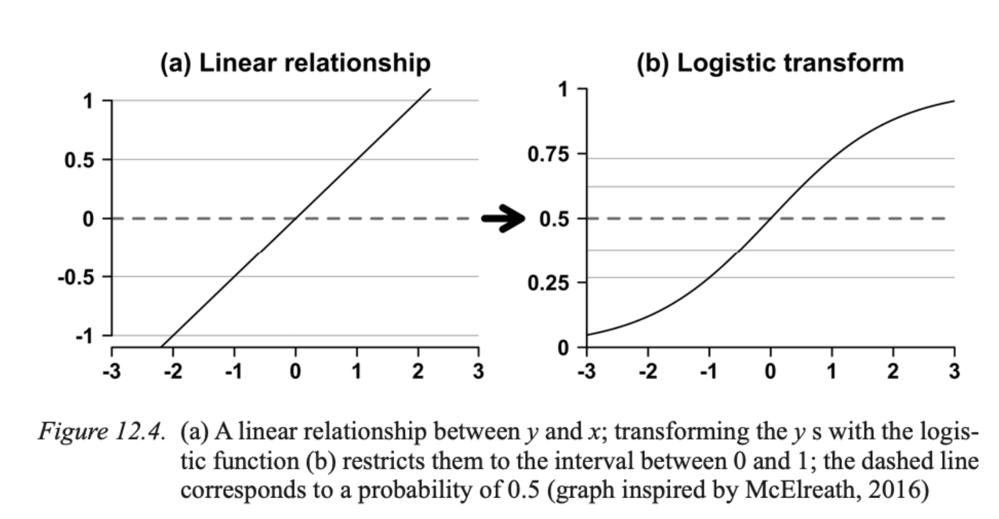
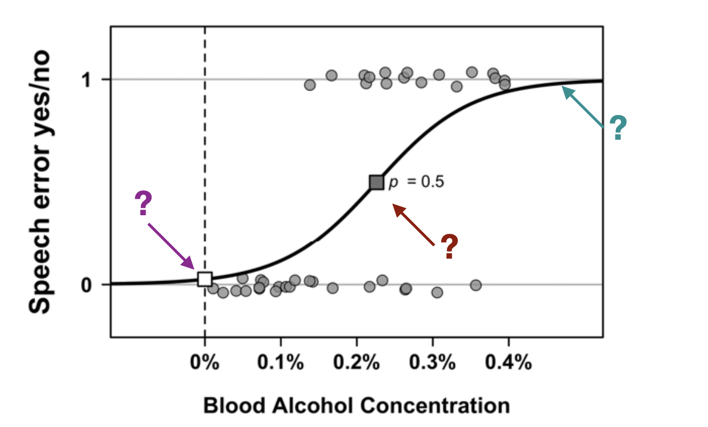

# Overview

[Logistic regression](https://en.wikipedia.org/wiki/Logistic_regression) models the relationships between a categorical response variable (with two or more possible values) and one or more explanatory variables (predictors).



***

So, rather than modeling the parameter p directly as a function of the predictors, the output of the predictive equation is transformed via the logistic function.


# Example

Let's consider a study by:

* Schiel, Florian; Heinrich, Christian; Barfüßer, Sabine (17. February 2011): Alcohol Language Corpus. 
The first public corpus of alcoholized German speech. In: Language Resources and Evaluation. Online: https://epub.ub.uni-muenchen.de/13691/

Here is the abstract:

>>> The Alcohol Language Corpus (ALC) is the first publicly available speech corpus comprising intoxicated and sober speech of 162 female and male German speakers. Recordings are done in the automotive environment to allow for the development of automatic alcohol detection and to ensure a consistent acoustic environment for the alcoholized and the sober recording. The recorded speech covers a variety of contents and speech styles. Breath and blood alcohol concentration measurements are provided for all speakers. A transcription according to SpeechDat/Verbmobil standards and disfluency tagging as well as an automatic phonetic segmentation are part of the corpus. An Emu version of ALC allows easy access to basic speech parameters as well as the us of R for statistical analysis of selected parts of ALC. ALC is available without restriction for scientific or commercial use at the Bavarian Archive for Speech Signals.

Some questions to think about:

* What kind of data has been collected?

* What kind of variables are (likely) in the dataset?

* What kind of dataset is being presented?

* How can we access the data?


# Reverse engineering the data

In its present state the ALC corpus covers the alcoholized and non-alcoholized speech of 77 female and 85 male speakers -- but the data cost over 1000 EUR to access (!).

So what can we do?

Let's reverse engineer the data as an example that we can then explore.

* What kind of data is present in the plot?
* What are the variables?



***

* BAC_level (0% -- 0.4%)
* Speech_error (yes/no)

***

Let's create a fake dataset.

```{r}
library(tidyverse)

# Create a `tibble`, i.e., a data frame in Tidyverse
df <- tibble(
  id = 1:30, 
  speech_error = c(1, 0, 1, 0, 1, 0, 1, 0, 1, 0, 1, 1, 1, 0, 0, 0, 1, 1, 1, 0, 0, 0, 0, 0, 1, 1, 1, 1, 0, 1),
  bac = c(0.2, 0, 0.3, 0.1, 0.4, 0.05, 0.3, 0.3, 0.25, 0.25, 0.39, 0.38, 0.36, 0.01, 0.02, 0.03, 0.24, 0.26, 0.25, 0.11, 0.12, 0.09, 0.08, .018, 0.21, 0.24, 0.23, 0.13, 0.16, 0.38),
  sex = c('Female', 'Male', 'Female', 'Male', 'Male', 'Female', 'Female', 'Male', 'Male', 'Female', 'Female', 'Female', 'Male', 'Male', 'Female', 'Male', 'Male', 'Male', 'Female', 'Female', 'Female', 'Male', 'Male', 'Female', 'Female', 'Male', 'Female', 'Male', 'Male', 'Female'),
  underage = c('Yes', 'Yes', 'Yes', 'No', 'No', 'Yes', 'No', 'No', 'Yes', 'Yes', 'Yes', 'No', 'No', 'No', 'Yes', 'No', 'Yes', 'Yes', 'No', 'No', 'Yes', 'No', 'Yes', 'No', 'Yes', 'No', 'No', 'Yes', 'Yes', 'No')
  )

# This function writes the data to a CSV file in the `data` folder in this directory
# write_csv(df, 'data/fake_bac_corpus.csv')

df
```

First let's plot the data.

```{r}
ggplot(df, aes(x=bac, y=speech_error)) + 
  geom_point(alpha=.5) +
  stat_smooth(method="glm", se=FALSE, method.args = list(family=binomial))
```

Perform the logistic regression.

```{r}
model <- glm(speech_error ~ bac, data = df, family=binomial())
summary(model)
```

```{r}
model <- glm(speech_error ~ bac + sex, data = df, family=binomial())
summary(model)
```

```{r}
model <- glm(speech_error ~ bac + underage + sex, data = df, family=binomial())
summary(model)
```

What else can we look at?

# Paired t-test

```{r}
ggplot(data = df, aes(x = sex, y = bac)) +
  geom_boxplot()
```

```{r}
ggplot(data = df, aes(x = underage, y = bac)) +
  geom_boxplot()
```

But to do the test, we will have to transform the data into a long format.

```{r}
# t.test(df$y, df$x, paired=T, alternative="greater")
```


