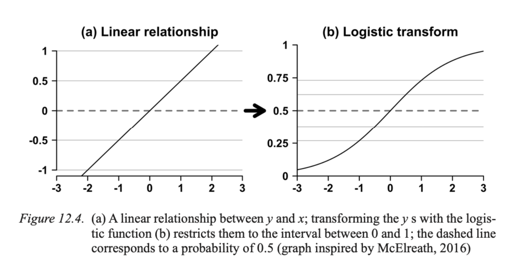
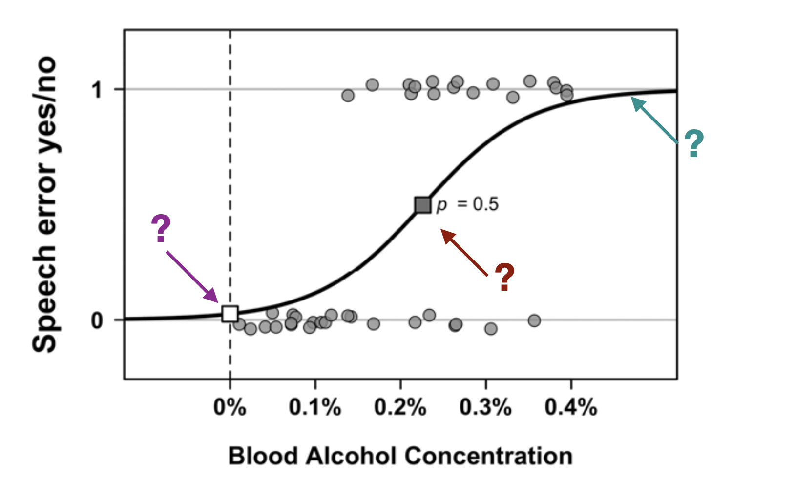
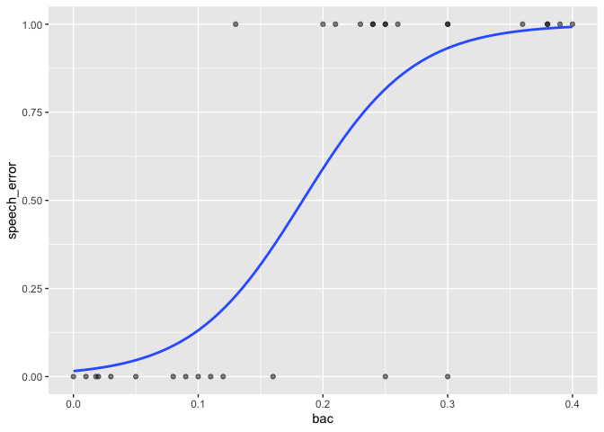
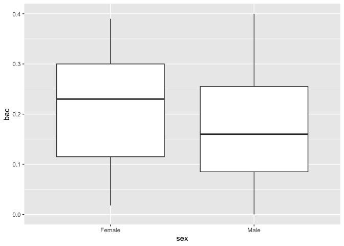
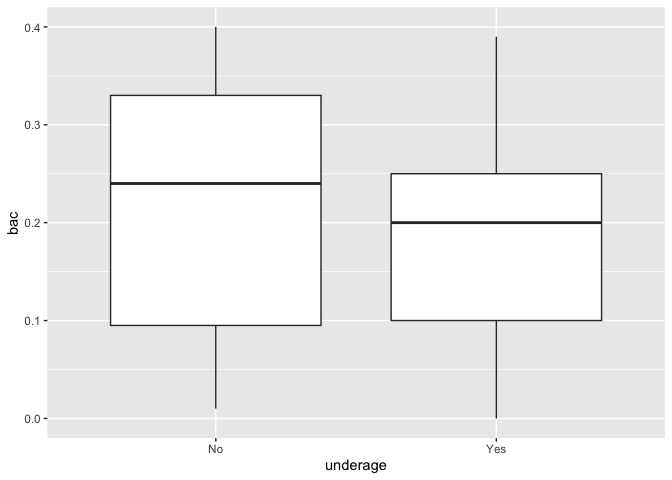

Logistic regression: alcohol language corpus
================
Steve Moran and Alena Witzlack-Makarevich
(23 March, 2023)

- [Overview](#overview)
- [Example](#example)
- [Reverse engineering the data](#reverse-engineering-the-data)
- [Paired t-test](#paired-t-test)

# Overview

[Logistic regression](https://en.wikipedia.org/wiki/Logistic_regression)
models the relationships between a categorical response variable (with
two or more possible values) and one or more explanatory variables
(predictors).

<figure>

<figcaption aria-hidden="true">BAC example.</figcaption>
</figure>

------------------------------------------------------------------------

So, rather than modeling the parameter p directly as a function of the
predictors, the output of the predictive equation is transformed via the
logistic function.

# Example

Let’s consider a study by:

- Schiel, Florian; Heinrich, Christian; Barfüßer, Sabine (17. February
  2011): Alcohol Language Corpus. The first public corpus of alcoholized
  German speech. In: Language Resources and Evaluation. Online:
  <https://epub.ub.uni-muenchen.de/13691/>

Here is the abstract:

> > > The Alcohol Language Corpus (ALC) is the first publicly available
> > > speech corpus comprising intoxicated and sober speech of 162
> > > female and male German speakers. Recordings are done in the
> > > automotive environment to allow for the development of automatic
> > > alcohol detection and to ensure a consistent acoustic environment
> > > for the alcoholized and the sober recording. The recorded speech
> > > covers a variety of contents and speech styles. Breath and blood
> > > alcohol concentration measurements are provided for all speakers.
> > > A transcription according to SpeechDat/Verbmobil standards and
> > > disfluency tagging as well as an automatic phonetic segmentation
> > > are part of the corpus. An Emu version of ALC allows easy access
> > > to basic speech parameters as well as the us of R for statistical
> > > analysis of selected parts of ALC. ALC is available without
> > > restriction for scientific or commercial use at the Bavarian
> > > Archive for Speech Signals.

Some questions to think about:

- What kind of data has been collected?

- What kind of variables are (likely) in the dataset?

- What kind of dataset is being presented?

- How can we access the data?

# Reverse engineering the data

In its present state the ALC corpus covers the alcoholized and
non-alcoholized speech of 77 female and 85 male speakers – but the data
cost over 1000 EUR to access (!).

So what can we do?

Let’s reverse engineer the data as an example that we can then explore.

- What kind of data is present in the plot?
- What are the variables?

<figure>

<figcaption aria-hidden="true">BAC example.</figcaption>
</figure>

------------------------------------------------------------------------

- BAC_level (0% – 0.4%)
- Speech_error (yes/no)

------------------------------------------------------------------------

Let’s create a fake dataset.

``` r
library(tidyverse)
```

    ## ── Attaching packages ─────────────────────────────────────── tidyverse 1.3.2 ──
    ## ✔ ggplot2 3.4.1      ✔ purrr   1.0.1 
    ## ✔ tibble  3.2.0      ✔ dplyr   1.0.10
    ## ✔ tidyr   1.3.0      ✔ stringr 1.5.0 
    ## ✔ readr   2.1.3      ✔ forcats 0.5.2 
    ## ── Conflicts ────────────────────────────────────────── tidyverse_conflicts() ──
    ## ✖ dplyr::filter() masks stats::filter()
    ## ✖ dplyr::lag()    masks stats::lag()

``` r
# Create a `tibble`, i.e., a data frame in Tidyverse
df <- tibble(
  id = 1:30, 
  speech_error = c(1, 0, 1, 0, 1, 0, 1, 0, 1, 0, 1, 1, 1, 0, 0, 0, 1, 1, 1, 0, 0, 0, 0, 0, 1, 1, 1, 1, 0, 1),
  bac = c(0.2, 0, 0.3, 0.1, 0.4, 0.05, 0.3, 0.3, 0.25, 0.25, 0.39, 0.38, 0.36, 0.01, 0.02, 0.03, 0.24, 0.26, 0.25, 0.11, 0.12, 0.09, 0.08, .018, 0.21, 0.24, 0.23, 0.13, 0.16, 0.38),
  sex = c('Female', 'Male', 'Female', 'Male', 'Male', 'Female', 'Female', 'Male', 'Male', 'Female', 'Female', 'Female', 'Male', 'Male', 'Female', 'Male', 'Male', 'Male', 'Female', 'Female', 'Female', 'Male', 'Male', 'Female', 'Female', 'Male', 'Female', 'Male', 'Male', 'Female'),
  underage = c('Yes', 'Yes', 'Yes', 'No', 'No', 'Yes', 'No', 'No', 'Yes', 'Yes', 'Yes', 'No', 'No', 'No', 'Yes', 'No', 'Yes', 'Yes', 'No', 'No', 'Yes', 'No', 'Yes', 'No', 'Yes', 'No', 'No', 'Yes', 'Yes', 'No')
  )

# This function writes the data to a CSV file in the `data` folder in this directory
# write_csv(df, 'data/fake_bac_corpus.csv')

df
```

    ## # A tibble: 30 × 5
    ##       id speech_error   bac sex    underage
    ##    <int>        <dbl> <dbl> <chr>  <chr>   
    ##  1     1            1  0.2  Female Yes     
    ##  2     2            0  0    Male   Yes     
    ##  3     3            1  0.3  Female Yes     
    ##  4     4            0  0.1  Male   No      
    ##  5     5            1  0.4  Male   No      
    ##  6     6            0  0.05 Female Yes     
    ##  7     7            1  0.3  Female No      
    ##  8     8            0  0.3  Male   No      
    ##  9     9            1  0.25 Male   Yes     
    ## 10    10            0  0.25 Female Yes     
    ## # … with 20 more rows

First let’s plot the data.

``` r
ggplot(df, aes(x=bac, y=speech_error)) + 
  geom_point(alpha=.5) +
  stat_smooth(method="glm", se=FALSE, method.args = list(family=binomial))
```

    ## `geom_smooth()` using formula = 'y ~ x'

<!-- -->

Perform the logistic regression.

``` r
model <- glm(speech_error ~ bac, data = df, family=binomial())
summary(model)
```

    ## 
    ## Call:
    ## glm(formula = speech_error ~ bac, family = binomial(), data = df)
    ## 
    ## Deviance Residuals: 
    ##     Min       1Q   Median       3Q      Max  
    ## -2.3192  -0.3986   0.1307   0.6215   1.7172  
    ## 
    ## Coefficients:
    ##             Estimate Std. Error z value Pr(>|z|)   
    ## (Intercept)   -4.146      1.571  -2.639  0.00830 **
    ## bac           22.550      7.592   2.970  0.00297 **
    ## ---
    ## Signif. codes:  0 '***' 0.001 '**' 0.01 '*' 0.05 '.' 0.1 ' ' 1
    ## 
    ## (Dispersion parameter for binomial family taken to be 1)
    ## 
    ##     Null deviance: 41.455  on 29  degrees of freedom
    ## Residual deviance: 19.503  on 28  degrees of freedom
    ## AIC: 23.503
    ## 
    ## Number of Fisher Scoring iterations: 6

``` r
model <- glm(speech_error ~ bac + sex, data = df, family=binomial())
summary(model)
```

    ## 
    ## Call:
    ## glm(formula = speech_error ~ bac + sex, family = binomial(), 
    ##     data = df)
    ## 
    ## Deviance Residuals: 
    ##     Min       1Q   Median       3Q      Max  
    ## -2.2818  -0.3917   0.1320   0.6116   1.7508  
    ## 
    ## Coefficients:
    ##             Estimate Std. Error z value Pr(>|z|)   
    ## (Intercept)  -4.0452     1.7157  -2.358  0.01839 * 
    ## bac          22.4457     7.6036   2.952  0.00316 **
    ## sexMale      -0.1622     1.1634  -0.139  0.88911   
    ## ---
    ## Signif. codes:  0 '***' 0.001 '**' 0.01 '*' 0.05 '.' 0.1 ' ' 1
    ## 
    ## (Dispersion parameter for binomial family taken to be 1)
    ## 
    ##     Null deviance: 41.455  on 29  degrees of freedom
    ## Residual deviance: 19.483  on 27  degrees of freedom
    ## AIC: 25.483
    ## 
    ## Number of Fisher Scoring iterations: 6

``` r
model <- glm(speech_error ~ bac + underage + sex, data = df, family=binomial())
summary(model)
```

    ## 
    ## Call:
    ## glm(formula = speech_error ~ bac + underage + sex, family = binomial(), 
    ##     data = df)
    ## 
    ## Deviance Residuals: 
    ##     Min       1Q   Median       3Q      Max  
    ## -2.0764  -0.3527   0.1288   0.5397   1.6315  
    ## 
    ## Coefficients:
    ##             Estimate Std. Error z value Pr(>|z|)   
    ## (Intercept)  -4.8099     2.1529  -2.234  0.02547 * 
    ## bac          23.5004     8.1334   2.889  0.00386 **
    ## underageYes   0.9386     1.2719   0.738  0.46057   
    ## sexMale      -0.2076     1.1816  -0.176  0.86051   
    ## ---
    ## Signif. codes:  0 '***' 0.001 '**' 0.01 '*' 0.05 '.' 0.1 ' ' 1
    ## 
    ## (Dispersion parameter for binomial family taken to be 1)
    ## 
    ##     Null deviance: 41.455  on 29  degrees of freedom
    ## Residual deviance: 18.908  on 26  degrees of freedom
    ## AIC: 26.908
    ## 
    ## Number of Fisher Scoring iterations: 6

What else can we look at?

# Paired t-test

``` r
ggplot(data = df, aes(x = sex, y = bac)) +
  geom_boxplot()
```

<!-- -->

``` r
ggplot(data = df, aes(x = underage, y = bac)) +
  geom_boxplot()
```

<!-- -->

But to do the test, we will have to transform the data into a long
format.

``` r
# t.test(df$y, df$x, paired=T, alternative="greater")
```
