Multiple linear regression example: heart disease
================
Steve Moran
(23 March, 2023)

- [Overview](#overview)
- [Load the data](#load-the-data)
- [Define your hypothesis](#define-your-hypothesis)
- [Choose a statistical test](#choose-a-statistical-test)
- [Check your model assumptions](#check-your-model-assumptions)
- [Perform the multiple linear regression
  analysis](#perform-the-multiple-linear-regression-analysis)
- [Check for homoscedasticity](#check-for-homoscedasticity)
- [Visualizing the multiple
  regression](#visualizing-the-multiple-regression)

------------------------------------------------------------------------

Load the libraries.

``` r
library(tidyverse)
library(knitr)
```

------------------------------------------------------------------------

# Overview

One way to test whether there is a relationship between two or more
independent variables and a dependent variable is [multiple linear
regression](https://en.wikipedia.org/wiki/Linear_regression).

Multiple linear regression is used to estimate the relationship between
**two or more independent variables** and **one dependent variable**.

You can use multiple linear regression when you want to know:

1.  How strong the relationship is between two or more independent
    variables and one dependent variable, e.g. how rainfall,
    temperature, and amount of fertilizer added affect crop growth.

2.  The value of the dependent variable at a certain value of the
    independent variables, e.g. the expected yield of a crop at certain
    levels of rainfall, temperature, and fertilizer addition.

Let’s look at an example taken from:

> > > Bevans, R. (2022, November 15). Multiple Linear Regression \| A
> > > Quick Guide (Examples). Scribbr. Retrieved March 20, 2023, from
> > > <https://www.scribbr.com/statistics/multiple-linear-regression/>

These data are an **imaginary sample**:

> > > You are a public health researcher interested in social factors
> > > that influence heart disease. You survey 500 towns and gather data
> > > on the percentage of people in each town who smoke, the percentage
> > > of people in each town who bike to work, and the percentage of
> > > people in each town who have heart disease.

And:

> > > Because you have two independent variables and one dependent
> > > variable, and all your variables are quantitative, you can use
> > > multiple linear regression to analyze the relationship between
> > > them.

Let’s go!

# Load the data

Let’s load the data.

``` r
df <- read_csv('data/heart.data.csv')
```

And have a look at it.

``` r
head(df) %>% 
  kable()
```

|  …1 |    biking |   smoking | heart.disease |
|----:|----------:|----------:|--------------:|
|   1 | 30.801246 | 10.896608 |     11.769423 |
|   2 | 65.129215 |  2.219563 |      2.854081 |
|   3 |  1.959664 | 17.588331 |     17.177803 |
|   4 | 44.800196 |  2.802559 |      6.816647 |
|   5 | 69.428454 | 15.974505 |      4.062223 |
|   6 | 54.403625 | 29.333175 |      9.550046 |

``` r
summary(df)
```

    ##       ...1           biking          smoking        heart.disease    
    ##  Min.   :  1.0   Min.   : 1.119   Min.   : 0.5259   Min.   : 0.5519  
    ##  1st Qu.:125.2   1st Qu.:20.205   1st Qu.: 8.2798   1st Qu.: 6.5137  
    ##  Median :249.5   Median :35.824   Median :15.8146   Median :10.3853  
    ##  Mean   :249.5   Mean   :37.788   Mean   :15.4350   Mean   :10.1745  
    ##  3rd Qu.:373.8   3rd Qu.:57.853   3rd Qu.:22.5689   3rd Qu.:13.7240  
    ##  Max.   :498.0   Max.   :74.907   Max.   :29.9467   Max.   :20.4535

We have data already, let’s look at what data types that we have. And
here’s its structure:

``` r
str(df)
```

    ## spc_tbl_ [498 × 4] (S3: spec_tbl_df/tbl_df/tbl/data.frame)
    ##  $ ...1         : num [1:498] 1 2 3 4 5 6 7 8 9 10 ...
    ##  $ biking       : num [1:498] 30.8 65.13 1.96 44.8 69.43 ...
    ##  $ smoking      : num [1:498] 10.9 2.22 17.59 2.8 15.97 ...
    ##  $ heart.disease: num [1:498] 11.77 2.85 17.18 6.82 4.06 ...
    ##  - attr(*, "spec")=
    ##   .. cols(
    ##   ..   ...1 = col_double(),
    ##   ..   biking = col_double(),
    ##   ..   smoking = col_double(),
    ##   ..   heart.disease = col_double()
    ##   .. )
    ##  - attr(*, "problems")=<externalptr>

Recall our discussion on [data types in
statistics](https://github.com/bambooforest/IntroDataScience/tree/main/3_data#data-types-in-statistics).

If we are interested in the effects of biking and smoking on heart
disease, what would be our:

- Independent (exploratory) variable(s)?
- Dependent (outcome) variable(s)?

One way to look at that relationship is to **plot the input** on the
x-axis and the output on the y-axis in a scatter plot.

For biking and heart disease:

``` r
ggplot(df, aes(biking, heart.disease)) +
  geom_point()
```

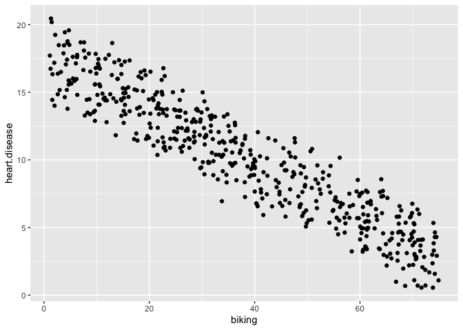<!-- -->

For smoking and heart disease:

``` r
ggplot(df, aes(smoking, heart.disease)) +
  geom_point()
```

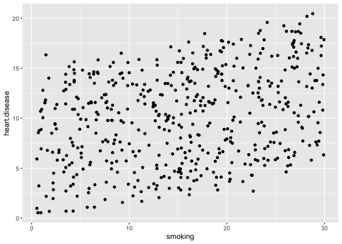<!-- -->

But the data set contains two variables. Let’s try some ways of
visualizing it.

``` r
ggplot(df) +
  geom_jitter(aes(biking, heart.disease), color="red") +
  geom_smooth(aes(biking, heart.disease, col="biking"), method="lm", se=FALSE) +
  geom_jitter(aes(smoking, heart.disease), color="green") + 
  geom_smooth(aes(smoking, heart.disease, col="smoking"), method="lm", se=FALSE)
```

    ## `geom_smooth()` using formula = 'y ~ x'
    ## `geom_smooth()` using formula = 'y ~ x'

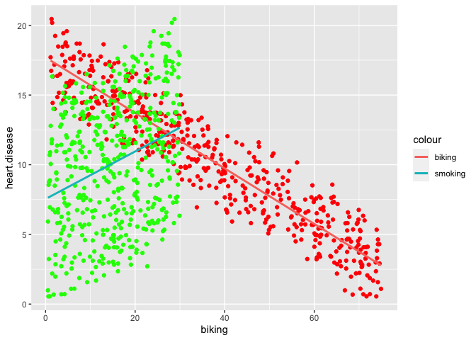<!-- -->

``` r
library(GGally)
```

    ## Registered S3 method overwritten by 'GGally':
    ##   method from   
    ##   +.gg   ggplot2

``` r
ggpairs(df, columns = 2:4)
```

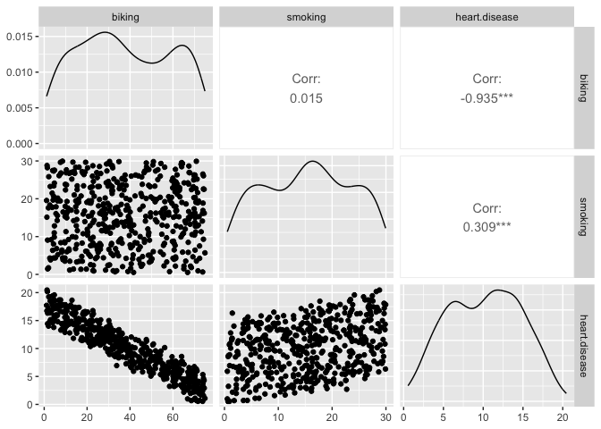<!-- -->

# Define your hypothesis

Recall any hypothesis testing follows these steps, broadly speaking:

1.  Choose a significance level (α)
2.  Formulate a null hypothesis, H0
3.  Formulate an alternative hypothesis, H1
4.  Gather data, calculate a test statistic, e.g. T or F
5.  Determine the probability (p-value) of obtaining T or F “or a more
    extreme value” under H0
6.  If p ≤ α, reject H0

And the basic process is:

- Set up a hypothesis, and assume that it is true.
- Gather data from some real-world experiment that is relevant to the
  hypothesis.
- Make a determination about the hypothesis, based on the idea of “how
  likely is our data given the hypothesis?”

------------------------------------------------------------------------

First, let’s set up our hypothesis regarding biking, smoking, and heart
disease.

- H0:
- H1:

# Choose a statistical test

What kind of statistical test can we use to test if there’s a
relationship between these variables?

Recall that the independent variable (predictor variable) is the
variable that is being manipulated, so that we can observe if there is
an effect on the dependent variable (outcome variable).

- Independent variable(s) – Predictor variable(s)
- Dependent variable(s) – Outcome/Output variable(s)

# Check your model assumptions

Like other statistical tests, **you will have to know the (four) main
assumptions** for multiple linear regression, i.e.:

- [Independence](https://en.wikipedia.org/wiki/Independence_(probability_theory))
  of observations (aka no
  [autocorrelation](https://en.wikipedia.org/wiki/Autocorrelation))
- [Normality](https://en.wikipedia.org/wiki/Normal_distribution)
- [Linearity](https://en.wikipedia.org/wiki/Linear_regression)
- [Homoscedasticity](https://en.wikipedia.org/wiki/Homoscedasticity_and_heteroscedasticity)
  (aka homogeneity of variance)

Two events are **independent** if the occurrence of one event does not
affect the chances of the occurrence of the other event.

We test for **normality** to see whether a set of data is distributed in
a way that is consistent with a [normal
distribution](https://en.wikipedia.org/wiki/Normal_distribution), when
our statistical test requires that the data points are normally
distributed.

**Linearity** is demonstrated when the mean values of the outcome
variable (dependent variable) for each increment of the predictors
(independent variables) lies along a straight line.

**Homoscedasticity** (homogeneity of variances) is an assumption of
equal or similar variances in different groups being compared.

<!--
[Parametric statistical test](https://en.wikipedia.org/wiki/Parametric_statistics) assume that data points in the sample come from a population that can be modeled by a [probability distribution](https://en.wikipedia.org/wiki/Probability_distribution) (i.e., a mathematical function that describes the probabilities of occurrence of the outcomes in an experiment) and that has a fixed set of [statistical parameters](https://en.wikipedia.org/wiki/Statistical_parameter). This assumption is important because parametric statistical tests are sensitive to any dissimilarities and uneven variance in samples will bias and skew the results.
-->

Here is a good and simple overview of linear models:

- <https://www.scribbr.com/statistics/multiple-linear-regression/>

------------------------------------------------------------------------

1.  Independence of observations (aka no
    [autocorrelation](https://en.wikipedia.org/wiki/Autocorrelation))

We need to make sure that the relationship between our independent
variables are not (too) highly correlated.

``` r
cor(df$biking, df$smoking)
```

    ## [1] 0.01513618

The
[correlation](https://www.scribbr.com/methodology/correlation-vs-causation/)
between biking and smoking in our dataset is small (0.015 equals 1.5%
correlation). This means that there is very little correlation between
our variables and that we can include both parameters in our model.

2.  Normality

We need to check if the dependent variable is normally distributed. We
can quickly visualize it. Does it look normal?

``` r
hist(df$heart.disease)
```

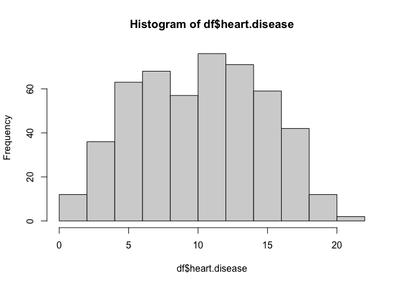<!-- -->

Another way to look for normality is with a quantile-quantile plot (Q-Q
plot), which is a graphical tool to assess whether the data come from
some probability distribution. It is a scatter plot that plots two sets
of [quantiles](https://en.wikipedia.org/wiki/Quantile) against each
other. If for example, we have a relatively straight line, we may assume
that our data points come from a normal distribution.

``` r
qqnorm(df$heart.disease, pch = 1, frame = FALSE) # Create the Q-Qplot
qqline(df$heart.disease, col = "steelblue", lwd = 2) # Add a blue line for reference
```

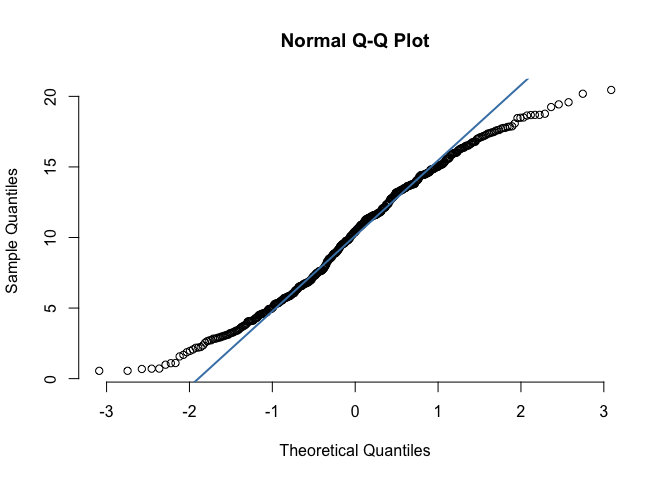<!-- -->

3.  Linearity

As we saw above, the data are linearly distributed. Here’s another way
to quickly visualize the x and y variables.

``` r
plot(heart.disease ~ biking, data = df)
```

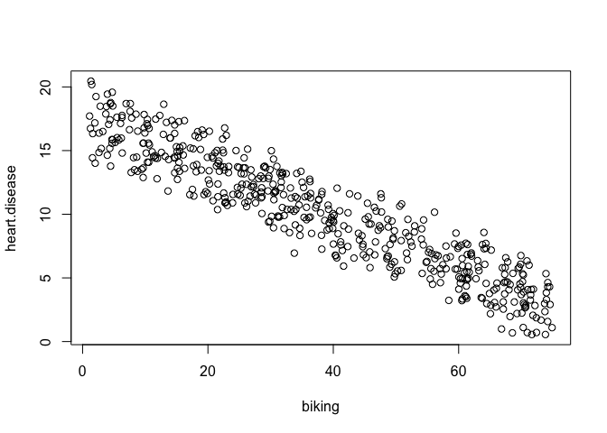<!-- -->

``` r
plot(heart.disease ~ smoking, data = df)
```

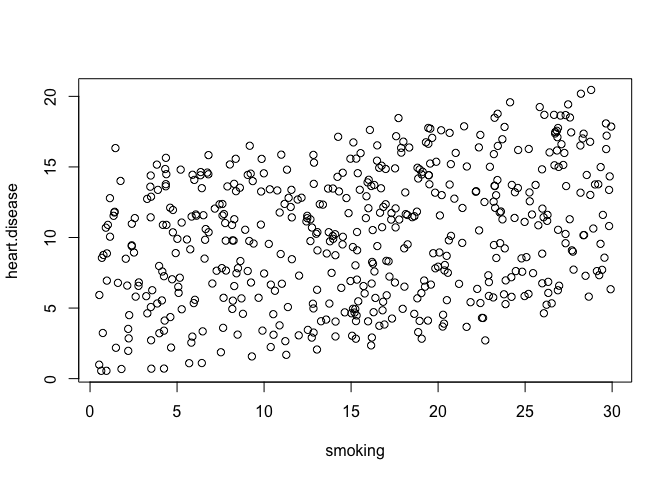<!-- -->

4.  Homoscedasticity (aka homogeneity of variance)

This means that the prediction error doesn’t change significantly over
the range of prediction of the model. We can test this assumption later,
after fitting the linear model.

# Perform the multiple linear regression analysis

So now we can do our linear regression and interpret the results.

``` r
lm <- lm(heart.disease ~ biking + smoking, data = df)
summary(lm)
```

    ## 
    ## Call:
    ## lm(formula = heart.disease ~ biking + smoking, data = df)
    ## 
    ## Residuals:
    ##     Min      1Q  Median      3Q     Max 
    ## -2.1789 -0.4463  0.0362  0.4422  1.9331 
    ## 
    ## Coefficients:
    ##              Estimate Std. Error t value Pr(>|t|)    
    ## (Intercept) 14.984658   0.080137  186.99   <2e-16 ***
    ## biking      -0.200133   0.001366 -146.53   <2e-16 ***
    ## smoking      0.178334   0.003539   50.39   <2e-16 ***
    ## ---
    ## Signif. codes:  0 '***' 0.001 '**' 0.01 '*' 0.05 '.' 0.1 ' ' 1
    ## 
    ## Residual standard error: 0.654 on 495 degrees of freedom
    ## Multiple R-squared:  0.9796, Adjusted R-squared:  0.9795 
    ## F-statistic: 1.19e+04 on 2 and 495 DF,  p-value: < 2.2e-16

How to interpret the results?

- The `Call` tells us what we’ve done.

- The `Residuals` reports the residuals and if they are centered roughly
  around zero with similar spreads on either side, then the model is
  likely a good fit for the assumption of heteroscedasticity.

- The regression `Coefficients` of the model show the `Intercept` in the
  first row, i.e., the y-intercept in the regression equation. This
  allows us to predict the values of the dependent variable:

> > > heart disease = 15 + (-0.2*biking) + (0.178*smoking) ± e

The estimated effect of biking on heart disease is -0.2 and the
estimated effect of smoking is 0.178. In other words:

- For every 1% increase in biking to work, there is a correlated 0.2%
  decrease in the incidence of heart disease.

- For every 1% increase in smoking, there is a 0.178% increase in the
  rate of heart disease.

The standard errors for these regression coefficients are very small,
which shows how much variation there is around the estimates of the
regression coefficent.

The t(est) statistics are very large (-147 and 50.4, respectively) – the
larger the test, the less likely the results occurred by chance. A
t-test is a statistical test used to compare the means of two groups.

The p values reflect these small errors and large t statistics.

For both parameters, there is almost zero probability that this effect
is due to chance.

Recall these data are fake! So, what can we say about the relationship
between biking and smoking on heart disease?

------------------------------------------------------------------------

Can we say there is a significant positive relationship between income
and happiness of these df (p-value \< 0.001).

------------------------------------------------------------------------

# Check for homoscedasticity

``` r
par(mfrow=c(2,2))
plot(lm)
```

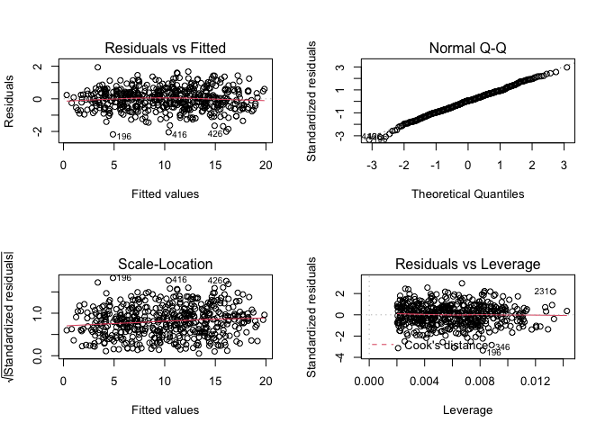<!-- -->

``` r
par(mfrow=c(1,1))
```

Residuals are the unexplained variance. They are not exactly the same as
model error, but they are calculated from it, so seeing a bias in the
residuals would also indicate a bias in the error.

The most important thing to look for is that the red lines representing
the mean of the residuals are all basically horizontal and centered
around zero. This means there are no outliers or biases in the data that
would make a linear regression invalid.

In the Normal Q-Qplot in the top right, we can see that the real
residuals from our model form an almost perfectly one-to-one line with
the theoretical residuals from a perfect model.

Based on these residuals, we can say that our model meets the assumption
of homoscedasticity.

# Visualizing the multiple regression

Visualizing multiple regression is a bit more tedious than a simple
linear regression because we have more than one independent variable.

One way is to plot the relationship between biking and heart disease at
different levels of smoking. Thus, we can treat smoking as a factor with
three levels, just for the purposes of displaying the relationships in
the data.

Create a new data frame.

``` r
plot_df <- expand.grid(
  biking = seq(min(df$biking), max(df$biking), length.out = 30),
    smoking=c(min(df$smoking), mean(df$smoking), max(df$smoking)))
```

Predict the values of heart disease based on your linear model.

``` r
plot_df$predicted_y <- predict.lm(lm, newdata = plot_df)
```

Let’s round the smoking numbers to two decimals.

``` r
plot_df$smoking <- round(plot_df$smoking, digits = 2)
```

Convert the `smoking` variable into a factor.

``` r
plot_df$smoking <- as.factor(plot_df$smoking)
```

Plot the data.

``` r
heart_plot <- ggplot(df, aes(x=biking, y=heart.disease)) +
  geom_point()

heart_plot
```

<!-- -->

Add the regression lines.

``` r
heart_plot <- heart_plot +
  geom_line(data = plot_df, aes(x = biking, y = predicted_y, color=smoking), size = 1.25)
```

    ## Warning: Using `size` aesthetic for lines was deprecated in ggplot2 3.4.0.
    ## ℹ Please use `linewidth` instead.
    ## This warning is displayed once every 8 hours.
    ## Call `lifecycle::last_lifecycle_warnings()` to see where this warning was
    ## generated.

``` r
heart_plot
```

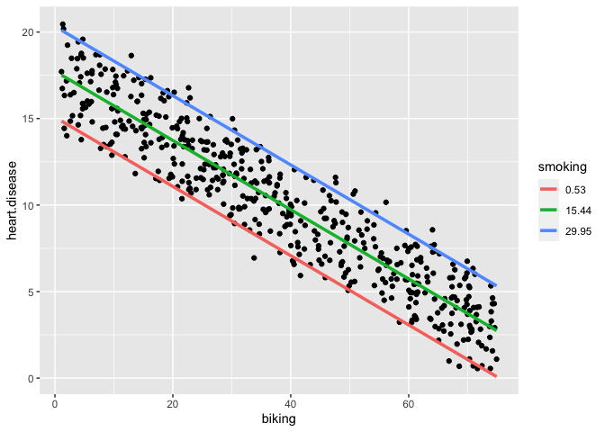<!-- -->

Make the plot a bit nicer.

``` r
heart_plot <-
heart_plot +
  theme_bw() +
  labs(title = "Rates of heart disease (% of population) \n as a function of biking to work and smoking",
      x = "Biking to work (% of population)",
      y = "Heart disease (% of population)",
      color = "Smoking \n (% of population)")

heart_plot
```

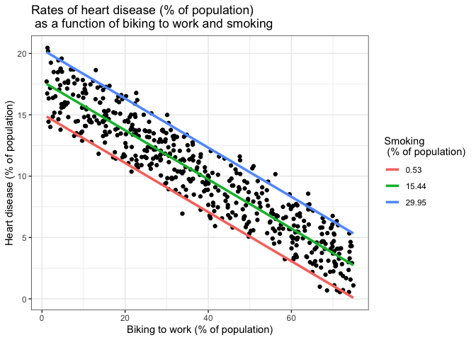<!-- -->

Because this graph has two regression coefficients, the
stat_regline_equation() function won’t work here. But if we want to add
our regression model to the graph, we can do so like this:

``` r
heart_plot + annotate(geom = "text", x = 30, y = 1.75, label = " = 15 + (-0.2*biking) + (0.178*smoking)")
```

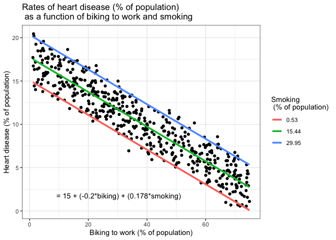<!-- -->

How can we report these results?

------------------------------------------------------------------------

Statistical tests are about interpreting data. If we want to interpret
our data with formal procedures and to make claims about the
distribution of our data or whether two data sets differ fundamentally
from each other, then we rely on hypothesis testing.
