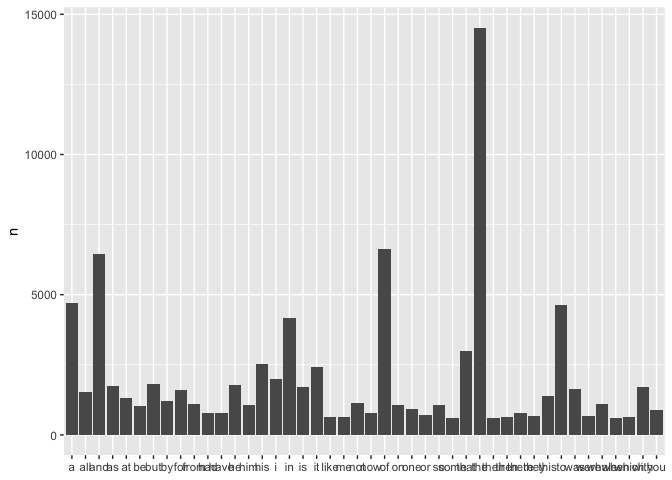
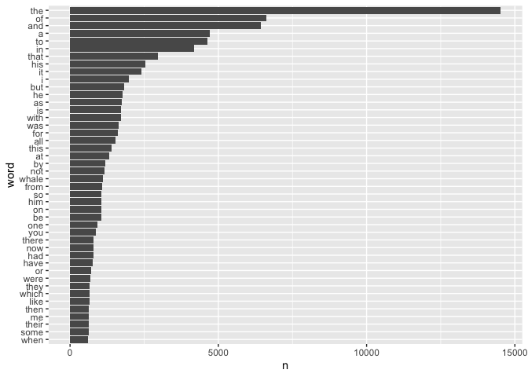
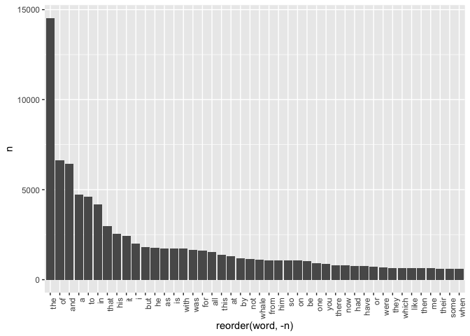
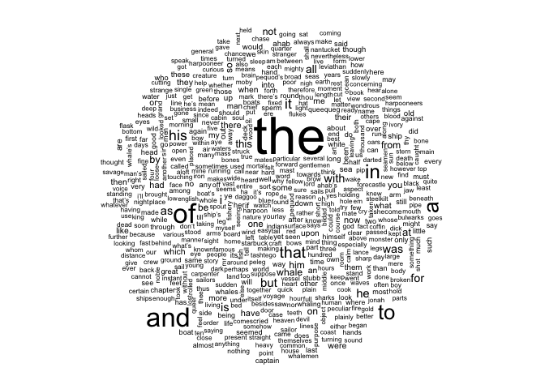
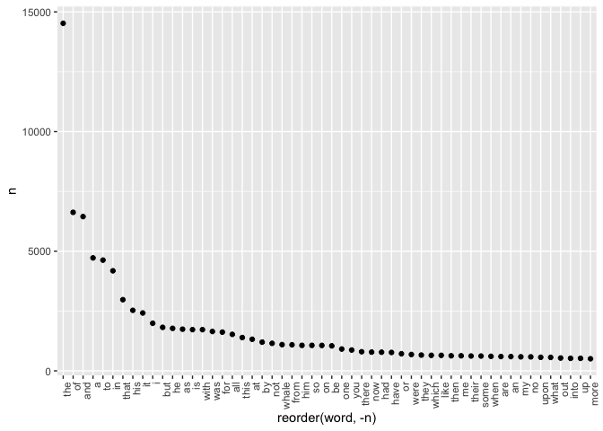
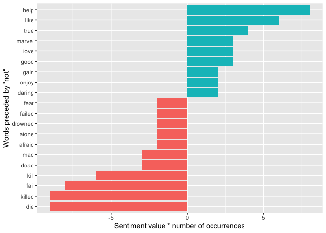
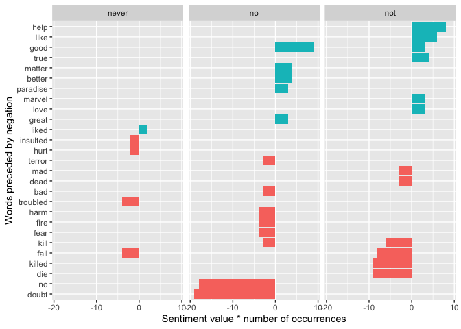

Words, text mining, some basic corpus linguistics
================
Steven Moran & Alena Witzlack-Makarevich
(28 February, 2023)

- [Setup](#setup)
- [Data](#data)
- [Exploration](#exploration)
- [Word type-token ratio (TTR)](#word-type-token-ratio-ttr)
- [Comparing vocabulary between
  corpora](#comparing-vocabulary-between-corpora)
- [Is Moby Dick all about men?](#is-moby-dick-all-about-men)
- [Ngrams](#ngrams)
- [Sentiment analysis](#sentiment-analysis)
- [References](#references)

# Setup

We use [R](https://www.r-project.org/) (R Core Team 2020) and the
following [R
packages](https://cran.r-project.org/web/packages/available_packages_by_name.html)
(Wickham et al. 2019; Silge and Robinson 2016; Fellows 2018; Johnston
and Robinson 2022).

``` r
library(tidyverse)
library(tidytext)
library(gutenbergr)
library(wordcloud)
```

Many of the examples are taken from or inspired by [Text Mining with R:
A Tidy Approach](https://www.tidytextmining.com) by [Julia
Silge](https://juliasilge.com) and [David
Robinson](http://varianceexplained.org).

# Data

We can access books from [Gutenberg](https://www.gutenberg.org) project
via the R [gutenbergr
package](https://cran.r-project.org/web/packages/gutenbergr/index.html).
Who was [Gutenberg](https://en.wikipedia.org/wiki/Johannes_Gutenberg)?

What can the `gutenbergr` package do?

``` r
?gutenbergr
```

When we look at the help, there are some functions native to this
package for browsing the collection of books.

``` r
gutenberg_metadata
```

    ## # A tibble: 69,199 × 8
    ##    gutenberg_id title              author guten…¹ langu…² guten…³ rights has_t…⁴
    ##           <int> <chr>              <chr>    <int> <chr>   <chr>   <chr>  <lgl>  
    ##  1            1 "The Declaration … Jeffe…    1638 en      Politi… Publi… TRUE   
    ##  2            2 "The United State… Unite…       1 en      Politi… Publi… TRUE   
    ##  3            3 "John F. Kennedy'… Kenne…    1666 en      <NA>    Publi… TRUE   
    ##  4            4 "Lincoln's Gettys… Linco…       3 en      US Civ… Publi… TRUE   
    ##  5            5 "The United State… Unite…       1 en      United… Publi… TRUE   
    ##  6            6 "Give Me Liberty … Henry…       4 en      Americ… Publi… TRUE   
    ##  7            7 "The Mayflower Co… <NA>        NA en      <NA>    Publi… TRUE   
    ##  8            8 "Abraham Lincoln'… Linco…       3 en      US Civ… Publi… TRUE   
    ##  9            9 "Abraham Lincoln'… Linco…       3 en      US Civ… Publi… TRUE   
    ## 10           10 "The King James V… <NA>        NA en      Banned… Publi… TRUE   
    ## # … with 69,189 more rows, and abbreviated variable names ¹​gutenberg_author_id,
    ## #   ²​language, ³​gutenberg_bookshelf, ⁴​has_text

``` r
gutenberg_authors
```

    ## # A tibble: 21,323 × 7
    ##    gutenberg_author_id author              alias birth…¹ death…² wikip…³ aliases
    ##                  <int> <chr>               <chr>   <int>   <int> <chr>   <chr>  
    ##  1                   1 United States       U.S.…      NA      NA https:… <NA>   
    ##  2                   3 Lincoln, Abraham    <NA>     1809    1865 https:… United…
    ##  3                   4 Henry, Patrick      <NA>     1736    1799 https:… <NA>   
    ##  4                   5 Adam, Paul          <NA>     1849    1931 https:… <NA>   
    ##  5                   7 Carroll, Lewis      Dodg…    1832    1898 https:… <NA>   
    ##  6                   8 United States. Cen… <NA>       NA      NA https:… Agency…
    ##  7                   9 Melville, Herman    Melv…    1819    1891 https:… <NA>   
    ##  8                  10 Barrie, J. M. (Jam… <NA>     1860    1937 https:… Barrie…
    ##  9                  12 Smith, Joseph, Jr.  Smit…    1805    1844 https:… <NA>   
    ## 10                  14 Madison, James      Unit…    1751    1836 https:… <NA>   
    ## # … with 21,313 more rows, and abbreviated variable names ¹​birthdate,
    ## #   ²​deathdate, ³​wikipedia

Let’s grab [Moby Dick](https://en.wikipedia.org/wiki/Moby-Dick) by
[Herman Melville](https://en.wikipedia.org/wiki/Herman_Melville).

On the web, it looks like this:

- <https://www.gutenberg.org/files/2701/2701-h/2701-h.htm>

Let’s download it and have a look. What has the `gutenberg_download()`
done?

``` r
moby_dick <- gutenberg_download(2701)
```

    ## Determining mirror for Project Gutenberg from https://www.gutenberg.org/robot/harvest

    ## Using mirror http://aleph.gutenberg.org

``` r
moby_dick
```

    ## # A tibble: 21,932 × 2
    ##    gutenberg_id text                
    ##           <int> <chr>               
    ##  1         2701 "MOBY-DICK;"        
    ##  2         2701 ""                  
    ##  3         2701 "or, THE WHALE."    
    ##  4         2701 ""                  
    ##  5         2701 "By Herman Melville"
    ##  6         2701 ""                  
    ##  7         2701 ""                  
    ##  8         2701 ""                  
    ##  9         2701 "CONTENTS"          
    ## 10         2701 ""                  
    ## # … with 21,922 more rows

Now, recall we want to work with [tidy
data](https://r4ds.had.co.nz/tidy-data.html) typically. What is
so-called tidy data?

1.  Each variable must have its own column.
2.  Each observation must have its own row.
3.  Each value must have its own cell.

How can we do that?

------------------------------------------------------------------------

One way is that we can use other people’s work, i.e., another library
that someone has created, to process the data for us. Pro-tip: when you
need something done, go look for it on the web before you build it from
scratch!

We can use the
[tidytext](https://cran.r-project.org/web/packages/tidytext/vignettes/tidytext.html)
package for that.

``` r
help(tidytext)
```

It has an `unnest_tokens()` function.

``` r
?unnest_tokens
```

``` r
tidy_moby_dick <- moby_dick %>%
  unnest_tokens(word, text)
```

Now what does our data structure look like?

``` r
tidy_moby_dick
```

    ## # A tibble: 216,928 × 2
    ##    gutenberg_id word     
    ##           <int> <chr>    
    ##  1         2701 moby     
    ##  2         2701 dick     
    ##  3         2701 or       
    ##  4         2701 the      
    ##  5         2701 whale    
    ##  6         2701 by       
    ##  7         2701 herman   
    ##  8         2701 melville 
    ##  9         2701 contents 
    ## 10         2701 etymology
    ## # … with 216,918 more rows

This took has *tokenized* the data for us, i.e., it has split the raw
data (sentences in parapgrahs in chapters in a book) into words.

*Tokenization* is the process of splitting text into tokens.

This one-token-per-row structure is in contrast to the ways text is
often stored, perhaps as strings or in a document-term matrix.

For tidy text mining, the token that is stored in each row is most often
a single word, but can also be an n-gram, sentence, or paragraph.

Now compare the first and tokenized data. What’s are the differences?

``` r
moby_dick
```

    ## # A tibble: 21,932 × 2
    ##    gutenberg_id text                
    ##           <int> <chr>               
    ##  1         2701 "MOBY-DICK;"        
    ##  2         2701 ""                  
    ##  3         2701 "or, THE WHALE."    
    ##  4         2701 ""                  
    ##  5         2701 "By Herman Melville"
    ##  6         2701 ""                  
    ##  7         2701 ""                  
    ##  8         2701 ""                  
    ##  9         2701 "CONTENTS"          
    ## 10         2701 ""                  
    ## # … with 21,922 more rows

``` r
tidy_moby_dick
```

    ## # A tibble: 216,928 × 2
    ##    gutenberg_id word     
    ##           <int> <chr>    
    ##  1         2701 moby     
    ##  2         2701 dick     
    ##  3         2701 or       
    ##  4         2701 the      
    ##  5         2701 whale    
    ##  6         2701 by       
    ##  7         2701 herman   
    ##  8         2701 melville 
    ##  9         2701 contents 
    ## 10         2701 etymology
    ## # … with 216,918 more rows

What happened in the `unnest_tokens()` function?

``` r
moby_dick
```

    ## # A tibble: 21,932 × 2
    ##    gutenberg_id text                
    ##           <int> <chr>               
    ##  1         2701 "MOBY-DICK;"        
    ##  2         2701 ""                  
    ##  3         2701 "or, THE WHALE."    
    ##  4         2701 ""                  
    ##  5         2701 "By Herman Melville"
    ##  6         2701 ""                  
    ##  7         2701 ""                  
    ##  8         2701 ""                  
    ##  9         2701 "CONTENTS"          
    ## 10         2701 ""                  
    ## # … with 21,922 more rows

``` r
moby_dick %>%
  unnest_tokens(word, text)
```

    ## # A tibble: 216,928 × 2
    ##    gutenberg_id word     
    ##           <int> <chr>    
    ##  1         2701 moby     
    ##  2         2701 dick     
    ##  3         2701 or       
    ##  4         2701 the      
    ##  5         2701 whale    
    ##  6         2701 by       
    ##  7         2701 herman   
    ##  8         2701 melville 
    ##  9         2701 contents 
    ## 10         2701 etymology
    ## # … with 216,918 more rows

What else happened?

Hint: bag of words.

Remember, use the power of the force. Help `?` is your friend – in all
its forms.

``` r
?unnest_tokens
help(unnest_tokens)
```

# Exploration

What can we do with this “bag of words”?

One thing we can do is ask R to calculate the number words (tokens) in
the novel.

``` r
length(tidy_moby_dick$word)
```

    ## [1] 216928

Another thing we can do is is ask R to calculate the number unique words
(types) in the novel.

``` r
length(unique(tidy_moby_dick$word))
```

    ## [1] 17868

R’s `unique()` function will examine all the values in the character
vector (word column) and identify those that are the same and those that
are different. By embedding the `unique()` function into the `length()`
function, you calculate the number of unique word types from all the
word tokens, i.e., all the unique words in Melville’s Moby Dick
vocabulary.

We can also ask R to `count()` the elements in the column for us.

What do we see here? What do we have to pass to the `count()` function?

``` r
tidy_moby_dick %>% 
  count(word)
```

    ## # A tibble: 17,868 × 2
    ##    word            n
    ##    <chr>       <int>
    ##  1 _a              6
    ##  2 _advancing_     2
    ##  3 _ahab           4
    ##  4 _algerine       1
    ##  5 _alive_         1
    ##  6 _all_           1
    ##  7 _am_            1
    ##  8 _anglo          1
    ##  9 _apology        1
    ## 10 _are_           1
    ## # … with 17,858 more rows

Most functions have parameters and we can tell them what to do with
certain variables or properties. How to know what they are? Ask for
help!

``` r
?count
```

There’s a parameter in `sort()` that is by default set to `FALSE`, i.e.,
if we do not tell the function `count()` explicitly,
`count(sort = TRUE)`, it will assume that it should NOT sort the count.

So what happens if we set `sort = TRUE`?

``` r
tidy_moby_dick %>% 
  count(word, sort = TRUE)
```

    ## # A tibble: 17,868 × 2
    ##    word      n
    ##    <chr> <int>
    ##  1 the   14523
    ##  2 of     6624
    ##  3 and    6447
    ##  4 a      4720
    ##  5 to     4627
    ##  6 in     4181
    ##  7 that   2974
    ##  8 his    2530
    ##  9 it     2418
    ## 10 i      1988
    ## # … with 17,858 more rows

That’s interesting, perhaps we want to save the results into a new data
frame that we can call by a new variable name.

``` r
moby_dick_word_counts <- tidy_moby_dick %>% 
  count(word, sort = TRUE)

moby_dick_word_counts
```

    ## # A tibble: 17,868 × 2
    ##    word      n
    ##    <chr> <int>
    ##  1 the   14523
    ##  2 of     6624
    ##  3 and    6447
    ##  4 a      4720
    ##  5 to     4627
    ##  6 in     4181
    ##  7 that   2974
    ##  8 his    2530
    ##  9 it     2418
    ## 10 i      1988
    ## # … with 17,858 more rows

Now we have a data frame with two columns that includes and two data
types:

- word
- n

How can we visualize these data?

- <https://www.data-to-viz.com>

------------------------------------------------------------------------

Let’s consider the column `n` (a common acronym used for “count”). What
kind of data type is it?

What kind of visualizations can we make with one numeric data point?

``` r
moby_dick_word_counts %>% 
  filter(n > 600) %>%
  ggplot(aes(x = word, y = n)) +
  geom_col() +
  xlab(NULL)
```

<!-- -->

This data visualization – a [bar
chart](https://en.wikipedia.org/wiki/Bar_chart) aka bar plot or bar
graph tells us what?

Is it useful as is?

How can we display the information more meaningfully for the reader?

``` r
tidy_moby_dick %>%
  count(word, sort = TRUE) %>% 
  filter(n > 600) %>%
  mutate(word = reorder(word, n)) %>% 
  ggplot(aes(word, n)) +
  geom_col() +
  coord_flip()
```

<!-- -->

``` r
tidy_moby_dick %>%
  count(word, sort = TRUE) %>% 
  filter(n > 600) %>%
  ggplot(aes(x = reorder(word, -n), y = n)) +
  geom_col() +
  theme(axis.text.x = element_text(angle = 90, hjust = 1))
```

<!-- -->

What’s another fun way to visualize one variable data?

``` r
tidy_moby_dick %>%
  count(word) %>%
  with(wordcloud(word, n, max.words = 600))
```

<!-- -->

------------------------------------------------------------------------

We can also do a so-called dot plot. Try it!

``` r
# Hint: use geom_point()
moby_dick_word_counts %>%
  filter(n > 500) %>% 
  ggplot(aes(x = reorder(word, -n), y = n)) +
  geom_point() +
  theme(axis.text.x = element_text(angle = 90, hjust = 1))
```

<!-- -->

------------------------------------------------------------------------

What if we’re interested in particular words?

How many occurrences of the word `whale` are in the book?

``` r
moby_dick_word_count <- tidy_moby_dick %>% 
  count(word, sort = TRUE)

moby_dick_word_count %>% filter(word == "whale")
```

    ## # A tibble: 1 × 2
    ##   word      n
    ##   <chr> <int>
    ## 1 whale  1096

But is this a lot?

The raw count does NOT tell us much in terms of the validity of some
hypothesis.

For example, is the word whale *much* more common in Moby Dick than in,
say, some other works? How about Jane Austen?

We cannot say, because frequency is a *relative* judgement.

One way to put this number “of whales” into perspective is to express it
as a percentage of the whole corpus, i.e., Moby Dick as a novel is over
200k words.

What percentage does the word for whale make out of the entire book, or
in corpus linguistics speak, the “corpus”?

``` r
whale_count <- moby_dick_word_count %>% filter(word == "whale")
```

But is that a lot, relatively speaking, compared to other words?

------------------------------------------------------------------------

Let’s express the words as a percentage of the whole corpus in which we
see the words.

How many words do we have in the whole book / corpus?

``` r
length(tidy_moby_dick$word)
```

    ## [1] 216928

Now we can use the total number of words as our denominator and we can
extend our data frame by adding a new column.

``` r
moby_dick_word_count$frequency <- moby_dick_word_count$n / length(tidy_moby_dick$word) * 100
moby_dick_word_count
```

    ## # A tibble: 17,868 × 3
    ##    word      n frequency
    ##    <chr> <int>     <dbl>
    ##  1 the   14523     6.69 
    ##  2 of     6624     3.05 
    ##  3 and    6447     2.97 
    ##  4 a      4720     2.18 
    ##  5 to     4627     2.13 
    ##  6 in     4181     1.93 
    ##  7 that   2974     1.37 
    ##  8 his    2530     1.17 
    ##  9 it     2418     1.11 
    ## 10 i      1988     0.916
    ## # … with 17,858 more rows

Now we can again look at how frequent *within* the text a given word is.

``` r
moby_dick_word_count %>% filter(word == "whale")
```

    ## # A tibble: 1 × 3
    ##   word      n frequency
    ##   <chr> <int>     <dbl>
    ## 1 whale  1096     0.505

``` r
moby_dick_word_count %>% filter(word == "harpoon")
```

    ## # A tibble: 1 × 3
    ##   word        n frequency
    ##   <chr>   <int>     <dbl>
    ## 1 harpoon    76    0.0350

# Word type-token ratio (TTR)

The type–token ratio is one of the basic corpus statistics.

Comparing the number of tokens in the text to the number of types of
tokens (unique word form) can tell us how large a range of vocabulary is
used in the text.

- TTR = (number of types/number of tokens), or
- TTR = (number of types/number of tokens) \* 100 (as a percentage)

TTR allows us to measure vocabulary variation between corpora: the
closer the result is to 1 (or 100%), the greater the vocabulary
variation.

Here’s our tidy data.

``` r
tidy_moby_dick
```

    ## # A tibble: 216,928 × 2
    ##    gutenberg_id word     
    ##           <int> <chr>    
    ##  1         2701 moby     
    ##  2         2701 dick     
    ##  3         2701 or       
    ##  4         2701 the      
    ##  5         2701 whale    
    ##  6         2701 by       
    ##  7         2701 herman   
    ##  8         2701 melville 
    ##  9         2701 contents 
    ## 10         2701 etymology
    ## # … with 216,918 more rows

Now let’s get the TTR.

``` r
types <- length(unique(tidy_moby_dick$word))
tokens <- length(tidy_moby_dick$word)
ttr <- types / tokens
ttr
```

    ## [1] 0.08236834

So now we can compare two (or more) texts to see which text has a
greater range of vocabulary. For example, consider the vocabulary of
rappers:

- <https://pudding.cool/projects/vocabulary/index.html>

# Comparing vocabulary between corpora

Now let’s compare the vocabulary range of Melville with, say, Jane
Austin – or some other book of your choosing.

This should get you started.

``` r
# You can replace with some other book -- maybe something at random? :)
sense_sensibility <- gutenberg_download(161)
sense_sensibility
```

    ## # A tibble: 12,673 × 2
    ##    gutenberg_id text                   
    ##           <int> <chr>                  
    ##  1          161 "[Illustration]"       
    ##  2          161 ""                     
    ##  3          161 ""                     
    ##  4          161 ""                     
    ##  5          161 ""                     
    ##  6          161 "Sense and Sensibility"
    ##  7          161 ""                     
    ##  8          161 "by Jane Austen"       
    ##  9          161 ""                     
    ## 10          161 "(1811)"               
    ## # … with 12,663 more rows

Which text has the greater range in vocabulary in terms of its
type-to-token ratio?

Put your code here:

``` r
tidy_sense_sensibility <- sense_sensibility %>%
  unnest_tokens(word, text)

types <- length(unique(tidy_moby_dick$word))
tokens <- length(tidy_moby_dick$word)
ttr <- types / tokens
ttr
```

    ## [1] 0.08236834

``` r
types <- length(unique(tidy_sense_sensibility$word))
tokens <- length(tidy_sense_sensibility$word)
ttr <- types / tokens
ttr
```

    ## [1] 0.05420196

How does the type-toke ratio between the two source look?

------------------------------------------------------------------------

But note we can also drill down into a specific words and compare them!

# Is Moby Dick all about men?

Let’s compare the (relative) frequencies of pronouns between texts for
the pronouns “he” and “she”.

Start first by calculating their normalized frequencies. Choose an
appropriate normalization base.

Next, filter for all relevant pronouns (e.g. with the notation %in% c(…)
or other filter options). Hint:

``` r
tidy_moby_dick %>% filter(word %in% c('he', 'his'))
```

    ## # A tibble: 4,306 × 2
    ##    gutenberg_id word 
    ##           <int> <chr>
    ##  1         2701 his  
    ##  2         2701 he   
    ##  3         2701 his  
    ##  4         2701 he   
    ##  5         2701 his  
    ##  6         2701 he   
    ##  7         2701 his  
    ##  8         2701 his  
    ##  9         2701 he   
    ## 10         2701 his  
    ## # … with 4,296 more rows

Compare the pronouns’ relative frequencies between texts. Write your
code here:

``` r
# Insert your code
```

What about Moby Dick versus some other text?

For comparison, load another text, pre-process it, and calculate the
normalized frequency of the two sets of pronouns.

``` r
# Insert your code here
```

# Ngrams

[N-grams](https://en.wikipedia.org/wiki/N-gram) is a sequence of n
tokens (usually words or characters), which typically come from a text
or corpus. Typically terms:

- unigram: one token
- bigram: two tokens
- trigram: three tokens

And so forth.

They are used in [language
models](https://en.wikipedia.org/wiki/Language_model), which are are
[probabilistic
distribution](https://en.wikipedia.org/wiki/Probability_distribution)
over sequences of words. Language models are used in computational
linguistics for lots of things, e.g.:

- machine translation
- speech recognition
- part-of-speech tagging
- optical character recognition and hand writing recognition
- information retrieval (e.g., search engines)

The `unnest_tokens()` function takes both other types tokenizations and
other lengths of tokenization.

``` r
moby_dick_bigrams <- moby_dick %>%
  unnest_tokens(bigram, text, token = "ngrams", n = 2)

moby_dick_bigrams
```

    ## # A tibble: 201,317 × 2
    ##    gutenberg_id bigram         
    ##           <int> <chr>          
    ##  1         2701 moby dick      
    ##  2         2701 <NA>           
    ##  3         2701 or the         
    ##  4         2701 the whale      
    ##  5         2701 <NA>           
    ##  6         2701 by herman      
    ##  7         2701 herman melville
    ##  8         2701 <NA>           
    ##  9         2701 <NA>           
    ## 10         2701 <NA>           
    ## # … with 201,307 more rows

How do we filter (out) the NAs? We can use the `is.na()` function.

``` r
moby_dick_bigrams <- moby_dick %>%
  unnest_tokens(bigram, text, token = "ngrams", n = 2) %>%
  filter(!is.na(bigram))

moby_dick_bigrams
```

    ## # A tibble: 198,017 × 2
    ##    gutenberg_id bigram           
    ##           <int> <chr>            
    ##  1         2701 moby dick        
    ##  2         2701 or the           
    ##  3         2701 the whale        
    ##  4         2701 by herman        
    ##  5         2701 herman melville  
    ##  6         2701 extracts supplied
    ##  7         2701 supplied by      
    ##  8         2701 by a             
    ##  9         2701 a sub            
    ## 10         2701 sub sub          
    ## # … with 198,007 more rows

Let’s count them.

``` r
moby_dick_bigrams %>% count(bigram, sort = TRUE)
```

    ## # A tibble: 107,358 × 2
    ##    bigram        n
    ##    <chr>     <int>
    ##  1 of the     1778
    ##  2 in the     1115
    ##  3 to the      701
    ##  4 from the    410
    ##  5 of his      355
    ##  6 and the     351
    ##  7 on the      340
    ##  8 the whale   329
    ##  9 of a        322
    ## 10 to be       318
    ## # … with 107,348 more rows

What do you notice about the words?

We can filter out so-called [stop
words](https://en.wikipedia.org/wiki/Stop_word), i.e., words that we
want to filter out of our data because they for example carry very
little meaning, such as “the”, “of”, etc.

To make this process easier, we first separate the bigrams into
different columns with the `separate()` function. (Tip: there’s also a
\`unite() function that will unite two columns!)

``` r
bigrams_separated <- moby_dick_bigrams %>%
  separate(bigram, c("word1", "word2"), sep = " ")

bigrams_separated
```

    ## # A tibble: 198,017 × 3
    ##    gutenberg_id word1    word2   
    ##           <int> <chr>    <chr>   
    ##  1         2701 moby     dick    
    ##  2         2701 or       the     
    ##  3         2701 the      whale   
    ##  4         2701 by       herman  
    ##  5         2701 herman   melville
    ##  6         2701 extracts supplied
    ##  7         2701 supplied by      
    ##  8         2701 by       a       
    ##  9         2701 a        sub     
    ## 10         2701 sub      sub     
    ## # … with 198,007 more rows

Now let’s filter.

``` r
bigrams_filtered <- bigrams_separated %>%
  filter(!word1 %in% stop_words$word) %>%
  filter(!word2 %in% stop_words$word)
```

And generate new counts.

``` r
bigram_counts <- bigrams_filtered %>% 
  count(word1, word2, sort = TRUE)

bigram_counts
```

    ## # A tibble: 23,124 × 3
    ##    word1   word2       n
    ##    <chr>   <chr>   <int>
    ##  1 sperm   whale     133
    ##  2 white   whale      87
    ##  3 moby    dick       78
    ##  4 captain ahab       56
    ##  5 mast    head       50
    ##  6 mast    heads      37
    ##  7 quarter deck       32
    ##  8 whale   ship       32
    ##  9 cried   ahab       31
    ## 10 sperm   whale’s    31
    ## # … with 23,114 more rows

How can we visualize this type of data?

# Sentiment analysis

Now we can use this format to look at certain contexts.

``` r
bigrams_separated %>%
  filter(word1 == "not") %>%
  count(word1, word2, sort = TRUE)
```

    ## # A tibble: 393 × 3
    ##    word1 word2     n
    ##    <chr> <chr> <int>
    ##  1 not   a        69
    ##  2 not   the      61
    ##  3 not   to       57
    ##  4 not   only     50
    ##  5 not   so       38
    ##  6 not   be       26
    ##  7 not   at       18
    ##  8 not   one      17
    ##  9 not   that     15
    ## 10 not   have     14
    ## # … with 383 more rows

And we can do some simple [sentiment
analysis](https://en.wikipedia.org/wiki/Sentiment_analysis) on text,
e.g., looking at polarity.

For more information, check out this chapter in the [Text Mining with
R](https://www.tidytextmining.com/sentiment.html) book (Silge and
Robinson 2017).

Sentiment analysis involves a lexicon that has been defined for values
such as positivity versus negativity. First we need sentiment lexicon.

``` r
AFINN <- get_sentiments("afinn")

AFINN
```

    ## # A tibble: 2,477 × 2
    ##    word       value
    ##    <chr>      <dbl>
    ##  1 abandon       -2
    ##  2 abandoned     -2
    ##  3 abandons      -2
    ##  4 abducted      -2
    ##  5 abduction     -2
    ##  6 abductions    -2
    ##  7 abhor         -3
    ##  8 abhorred      -3
    ##  9 abhorrent     -3
    ## 10 abhors        -3
    ## # … with 2,467 more rows

So let’s look at the words preceded by “not” and their associated
sentiment.

``` r
not_words <- bigrams_separated %>%
  filter(word1 == "not") %>%
  inner_join(AFINN, by = c(word2 = "word")) %>%
  count(word2, value, sort = TRUE)

not_words
```

    ## # A tibble: 51 × 3
    ##    word2   value     n
    ##    <chr>   <dbl> <int>
    ##  1 fail       -2     4
    ##  2 help        2     4
    ##  3 die        -3     3
    ##  4 killed     -3     3
    ##  5 like        2     3
    ##  6 kill       -3     2
    ##  7 true        2     2
    ##  8 afraid     -2     1
    ##  9 alone      -2     1
    ## 10 curious     1     1
    ## # … with 41 more rows

Now we can visualize the results.

``` r
not_words %>%
  mutate(contribution = n * value) %>%
  arrange(desc(abs(contribution))) %>%
  head(20) %>%
  mutate(word2 = reorder(word2, contribution)) %>%
  ggplot(aes(n * value, word2, fill = n * value > 0)) +
  geom_col(show.legend = FALSE) +
  labs(x = "Sentiment value * number of occurrences",
       y = "Words preceded by \"not\"")
```

<!-- -->

The bigrams “not die” and “not killed” may be giving the text a more
negative sentiment. For example, we could compare this to another text
and compare them.

We can also look at more negation words.

``` r
negation_words <- c("not", "no", "never", "without")

negated_words <- bigrams_separated %>%
  filter(word1 %in% negation_words) %>%
  inner_join(AFINN, by = c(word2 = "word")) %>%
  count(word1, word2, value, sort = TRUE)
```

``` r
negated_words %>%
  mutate(contribution = n * value) %>%
  arrange(desc(abs(contribution))) %>%
  head(30) %>%
  mutate(word2 = reorder(word2, contribution)) %>%
  ggplot(aes(n * value, word2, fill = n * value > 0)) +
  geom_col(show.legend = FALSE) +
  labs(x = "Sentiment value * number of occurrences",
       y = "Words preceded by negation") +
  facet_grid(~word1)
```

<!-- -->

# References

<div id="refs" class="references csl-bib-body hanging-indent">

<div id="ref-wordcloud" class="csl-entry">

Fellows, Ian. 2018. *Wordcloud: Word Clouds*.
<https://CRAN.R-project.org/package=wordcloud>.

</div>

<div id="ref-gutenbergr" class="csl-entry">

Johnston, Myfanwy, and David Robinson. 2022. *Gutenbergr: Download and
Process Public Domain Works from Project Gutenberg*.
<https://CRAN.R-project.org/package=gutenbergr>.

</div>

<div id="ref-R" class="csl-entry">

R Core Team. 2020. *R: A Language and Environment for Statistical
Computing*. Vienna, Austria: R Foundation for Statistical Computing.
<https://www.R-project.org/>.

</div>

<div id="ref-tidytext" class="csl-entry">

Silge, Julia, and David Robinson. 2016. “Tidytext: Text Mining and
Analysis Using Tidy Data Principles in r.” *JOSS* 1 (3).
<https://doi.org/10.21105/joss.00037>.

</div>

<div id="ref-SilgeRobinson2017" class="csl-entry">

———. 2017. *Text Mining with r: A Tidy Approach*. O’Reilly Media, Inc.

</div>

<div id="ref-tidyverse" class="csl-entry">

Wickham, Hadley, Mara Averick, Jennifer Bryan, Winston Chang, Lucy
D’Agostino McGowan, Romain François, Garrett Grolemund, et al. 2019.
“Welcome to the <span class="nocase">tidyverse</span>.” *Journal of Open
Source Software* 4 (43): 1686. <https://doi.org/10.21105/joss.01686>.

</div>

</div>
